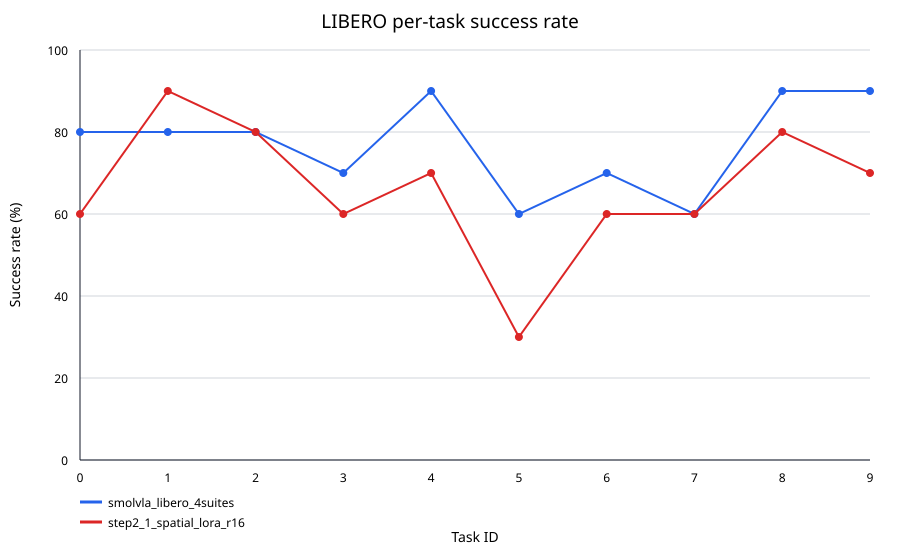
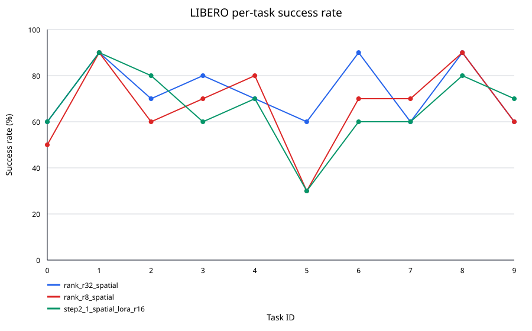
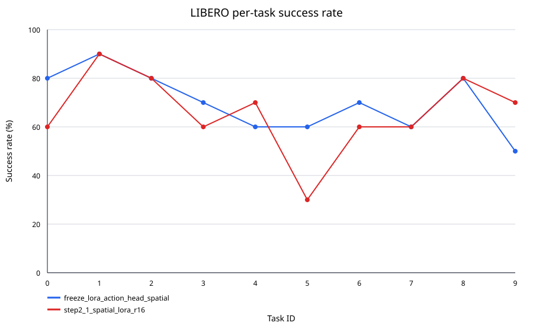
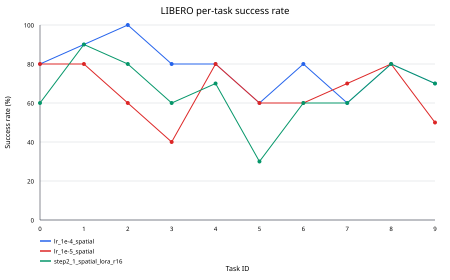
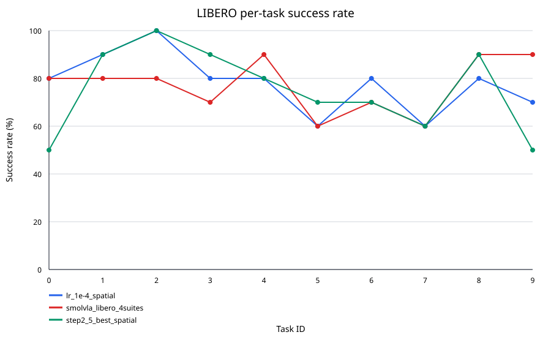

# Step 0：准备数据集和模型权重

本项目使用以下 Hugging Face 仓库：

- 数据集：`HuggingFaceVLA/libero`
- 模型权重：`HuggingFaceVLA/smolvla_libero`

先安装 Hugging Face CLI。两个仓库均为公开仓库，可以直接下载；如需更高的下载限额，可先执行可选的登录命令：

```bash
# 可选
HF_ENDPOINT=https://huggingface.co hf auth login

HF_ENDPOINT=https://huggingface.co \
HF_HUB_DOWNLOAD_TIMEOUT=600 \
HF_HUB_ETAG_TIMEOUT=60 \
hf download HuggingFaceVLA/libero \
  --repo-type dataset \
  --revision v3.0 \
  --local-dir /home/evoild/program/smolVLA_mujoco_LIBERO/libero \
  --max-workers 1

HF_ENDPOINT=https://huggingface.co \
HF_HUB_DOWNLOAD_TIMEOUT=600 \
HF_HUB_ETAG_TIMEOUT=60 \
hf download HuggingFaceVLA/smolvla_libero \
  --local-dir /home/evoild/program/smolVLA_mujoco_LIBERO/smolvla_libero \
  --max-workers 1
```

下载支持断点续传。完成后检查必要文件：

```bash
test -f libero/meta/info.json
test -f smolvla_libero/config.json
test -f smolvla_libero/model.safetensors
```

## `smolvla_libero` 的训练方法

根据 [SmolVLA 论文（arXiv:2506.01844）](https://arxiv.org/abs/2506.01844)，论文中的 LIBERO 模型采用以下方法：

- 使用预训练的 `SmolVLM-2` 作为视觉语言骨干，而不是从随机权重训练整个模型。
- 不使用机器人数据预训练权重作为 LIBERO 初始化；在论文 Table 2 中，SmolVLA 的 `VLA Pt` 标记为 `No`。
- 在 LIBERO 的 Spatial、Object、Goal 和 Long 四个 suite、共 40 个任务和 1,693 episodes 上进行多任务训练。
- 冻结 VLM，只训练 action expert。450M 版本约有 100M 参数属于 action expert。
- action expert 使用 flow matching 学习动作分布，一次预测长度为 50 的 action chunk。
- 论文中的仿真训练配置为 100,000 steps、batch size 64；输入图像缩放到 `512×512`。
- 仿真推理时每执行一个动作就重新读取观测并预测，flow-matching 推理使用 10 steps。
- 评测时每个 LIBERO 任务运行 10 次，任务完整完成记为成功。


# Step 1：LIBERO benchmark 评测

使用 SmolVLA 模型在 LIBERO 的 4 个任务套件上进行评测。每个套件包含 10 个任务，每个任务运行 10 个 episode，共评测 400 个 episode。

## 运行命令

```bash
lerobot-eval \
  --policy.path=/home/evoild/program/smolVLA_mujoco_LIBERO/smolvla_libero \
  --policy.device=cuda \
  --env.type=libero \
  --env.task=libero_spatial,libero_object,libero_goal,libero_10 \
  --eval.batch_size=1 \
  --eval.n_episodes=10 \
  --env.max_parallel_tasks=1 \
  --output_dir=/home/evoild/program/smolVLA_mujoco_LIBERO/eval_results/smolvla_libero_4suites
```

该命令未显式传入 seed，使用当前 LeRobot 版本的默认 seed `1000`。

## 评测结果

| 任务套件 | 成功次数 | Episode 数 | 成功率 |
| --- | ---: | ---: | ---: |
| LIBERO-Spatial | 77 | 100 | 77% |
| LIBERO-Object | 77 | 100 | 77% |
| LIBERO-Goal | 66 | 100 | 66% |
| LIBERO-10 | 41 | 100 | 41% |
| **总体** | **261** | **400** | **65.25%** |

评测总耗时约 4.03 小时，平均每个 episode 36.27 秒。

## 可视化

下图展示每个任务的成功率：


详细结果：

- [`summary.csv`](docs/baseline/summary.csv)：各任务套件和总体成功率。
- [`per_task.csv`](docs/baseline/per_task.csv)：40 个具体任务的成功率。
- [`failures.csv`](docs/baseline/failures.csv)：139 个失败 episode 及其回放视频路径。

## 失败案例总结

| 任务套件 | 失败次数 | 失败率 |
| --- | ---: | ---: |
| LIBERO-Spatial | 23 | 23% |
| LIBERO-Object | 23 | 23% |
| LIBERO-Goal | 34 | 34% |
| LIBERO-10 | 59 | 59% |

失败主要集中在以下情况：

- **双物体长时序任务**：LIBERO-10 的 task 0、4、7 成功率为 0%，task 8 为 10%。模型经常只处理第一个物体，无法稳定切换并完成第二个子目标。
- **误差随时间累积**：长任务最多运行 520 steps，早期抓取或放置产生的偏差会影响后续动作，最终运行至超时。
- **精细放置不稳定**：将物体放入抽屉、微波炉、篮子后部或指定盘子时，可能接近目标但未满足成功条件。
- **抓取与重新抓取失败**：部分轨迹中机械臂会在目标附近反复调整，出现抓取偏移、物体滑落或无法恢复的问题。

总体来看，模型的单物体抓取放置能力较好，主要短板是长时序任务中的子目标切换、双物体操作和精细放置。

## Baseline结论

- SmolVLA在Spatial和Object任务上表现较好（77%）。
- Goal任务下降至66%，说明长时序操作开始成为瓶颈。
- LIBERO-10仅41%，说明模型在组合泛化和多阶段规划任务上存在明显性能下降。
- 失败主要来自双物体任务、长时序误差累积和精细放置不稳定。
- 后续工作将通过LoRA微调、冻结策略研究和Action Chunk实验分析模型性能提升空间。

## 重新生成报告

```bash
python3 scripts/analyze_eval.py \
  eval_results/smolvla_libero_4suites/eval_info.json \
  --output-dir docs/baseline
```

# Step 2：LoRA 微调计划

以下实验统一使用 `/home/evoild/program/smolVLA_mujoco_LIBERO/smolvla_libero` 作为起点，但训练数据严格限制为 `libero_spatial` 的 432 个 episode（10 个任务），训练 20,000 steps，并只在 LIBERO-Spatial 上评测。这样可以与当前 `77%` 的结果直接比较。下面每条命令都包含完整参数，可以独立复制执行。

除每一步明确研究的变量外，统一控制条件为：训练 seed `0`、batch size `8`、20,000 steps、`lora_alpha=32`、每 10,000 steps 保存 checkpoint、评测 seed `1000`、每个 Spatial 任务评测 10 episodes。Step 2-2 只改变 Rank，Step 2-3 只改变 Action Head 的训练方式，Step 2-4 只改变学习率。

首次运行前安装 PEFT 依赖：

```bash
pip install -e "./lerobot[peft]"
```

### Step 2-1：LoRA 最小实验

固定 `Rank=16`。先运行 100 steps，确认日志显示 `dataset.num_episodes=432`，证明训练数据已经严格限制为 Spatial：

```bash
mkdir -p runs/logs

HF_HUB_OFFLINE=1 bash scripts/train_smolvla_peft.sh \
  --dataset-repo-id HuggingFaceVLA/libero \
  --dataset-root /home/evoild/program/smolVLA_mujoco_LIBERO/libero \
  --dataset-suite libero_spatial \
  --policy-path /home/evoild/program/smolVLA_mujoco_LIBERO/smolvla_libero \
  --output-dir runs/peft/minimal/spatial_lora_r16_smoke_seed0 \
  --seed 0 \
  --lora-rank 16 \
  --lora-alpha 32 \
  --lr 5e-5 \
  --steps 100 \
  --batch-size 8 \
  --save-freq 10000 \
  --num-workers 4 \
  --freeze-strategy lora_only \
  --wandb false

bash scripts/eval_libero.sh \
  --policy-path runs/peft/minimal/spatial_lora_r16_smoke_seed0/checkpoints/last/pretrained_model \
  --tasks libero_spatial \
  --seeds 1000 \
  --episodes 1 \
  --batch-size 1 \
  --max-parallel-tasks 1 \
  --device cuda \
  --output-dir eval_results/step2_1_spatial_lora_r16_smoke
```

Smoke 训练和评测通过后，再运行正式 20,000-step Spatial-only 训练：

```bash
HF_HUB_OFFLINE=1 /usr/bin/time -v bash scripts/train_smolvla_peft.sh \
  --dataset-repo-id HuggingFaceVLA/libero \
  --dataset-root /home/evoild/program/smolVLA_mujoco_LIBERO/libero \
  --dataset-suite libero_spatial \
  --policy-path /home/evoild/program/smolVLA_mujoco_LIBERO/smolvla_libero \
  --output-dir runs/peft/minimal/spatial_lora_r16_seed0 \
  --seed 0 \
  --lora-rank 16 \
  --lora-alpha 32 \
  --lr 5e-5 \
  --steps 20000 \
  --batch-size 8 \
  --save-freq 10000 \
  --num-workers 4 \
  --freeze-strategy lora_only \
  --wandb false \
  2>&1 | tee runs/logs/spatial_lora_only_r16_seed0.log

bash scripts/eval_libero.sh \
  --policy-path runs/peft/minimal/spatial_lora_r16_seed0/checkpoints/last/pretrained_model \
  --tasks libero_spatial \
  --seeds 1000 \
  --episodes 10 \
  --batch-size 1 \
  --max-parallel-tasks 1 \
  --device cuda \
  --output-dir eval_results/step2_1_spatial_lora_r16
```

评测完成后，将微调结果与 Step 1 的 baseline 放在同一个报告中：

```bash
python3 scripts/analyze_eval.py \
  eval_results/smolvla_libero_4suites/eval_info.json \
  eval_results/step2_1_spatial_lora_r16/eval_info.json \
  --plot-suite libero_spatial \
  --output-dir docs/step2_1_comparison
```

曲线中的两条线分别表示微调前后的 10 个 Spatial 任务，不会聚合两个模型的结果：



对比数据保存在 `docs/step2_1_comparison/summary.csv`，逐任务结果保存在
`docs/step2_1_comparison/per_task.csv`：

| 模型 | 训练数据 | LIBERO-Spatial 成功率 |
| --- | --- | ---: |
| Baseline：`smolvla_libero` | 原始 checkpoint | 77% |
| LoRA Rank 16 | LIBERO-Spatial 432 episodes | 66%（下降 11 个百分点） |

### Step 2-2：Rank 实验


保持学习率、训练步数、freeze strategy 和 seed 不变，只修改 Rank。Rank 16 直接复用 Step 2-1，因此这里只需新增 Rank 8 和 32：

```bash
HF_HUB_OFFLINE=1 \
DATASET_ROOT=/home/evoild/program/smolVLA_mujoco_LIBERO/libero \
DATASET_SUITE=libero_spatial \
RANKS=8,32 \
SEEDS=0 \
LR=5e-5 \
LORA_ALPHA=32 \
BATCH_SIZE=8 \
SAVE_FREQ=10000 \
NUM_WORKERS=4 \
FREEZE_STRATEGY=lora_only \
WANDB=false \
bash scripts/run_peft_sweep.sh \
  HuggingFaceVLA/libero \
  /home/evoild/program/smolVLA_mujoco_LIBERO/smolvla_libero \
  20000

for rank in 8 32; do
  bash scripts/eval_libero.sh \
    --policy-path "runs/peft/rank/libero_spatial_lora_r${rank}_lr5e-5_seed0/checkpoints/last/pretrained_model" \
    --tasks libero_spatial \
    --seeds 1000 \
    --episodes 10 \
    --batch-size 1 \
    --max-parallel-tasks 1 \
    --device cuda \
    --output-dir "eval_results/rank_r${rank}_spatial"
done

python3 scripts/analyze_eval.py \
  eval_results/rank_r8_spatial/eval_info.json \
  eval_results/step2_1_spatial_lora_r16/eval_info.json \
  eval_results/rank_r32_spatial/eval_info.json \
  --plot-suite libero_spatial \
  --output-dir docs/step2_2_rank_comparison
```

| Rank | LIBERO-Spatial 成功率 |
| ---: | ---: |
| 8 | 67% |
| 16 | 66%（复用 Step 2-1） |
| 32 | 73% |



详细结果：[`summary.csv`](docs/step2_2_rank_comparison/summary.csv) 和
[`per_task.csv`](docs/step2_2_rank_comparison/per_task.csv)。在当前单 seed 实验中，Rank 32 最好，
比 Rank 16 高 7 个百分点，但仍比 77% 的原始 baseline 低 4 个百分点。

### Step 2-3：Freeze Strategy

实验 A 复用 Step 2-1：LM expert、state projection 和四个 action projection modules 都只训练 LoRA adapter。实验 B 保持 LM expert 和 state projection 的 LoRA，同时将 `action_in_proj`、`action_out_proj`、`action_time_mlp_in` 和 `action_time_mlp_out` 改为全参数训练。因此两组实验唯一的区别是 Action Head 使用 LoRA 还是全参数训练：

```bash
mkdir -p runs/logs

HF_HUB_OFFLINE=1 /usr/bin/time -v bash scripts/train_smolvla_peft.sh \
  --dataset-repo-id HuggingFaceVLA/libero \
  --dataset-root /home/evoild/program/smolVLA_mujoco_LIBERO/libero \
  --dataset-suite libero_spatial \
  --policy-path /home/evoild/program/smolVLA_mujoco_LIBERO/smolvla_libero \
  --output-dir runs/peft/freeze/spatial_lora_action_head_r16_seed0 \
  --seed 0 \
  --lora-rank 16 \
  --lora-alpha 32 \
  --lr 5e-5 \
  --steps 20000 \
  --batch-size 8 \
  --save-freq 10000 \
  --num-workers 4 \
  --freeze-strategy lora_action_head \
  --wandb false \
  2>&1 | tee runs/logs/spatial_lora_action_head_r16_seed0.log

bash scripts/eval_libero.sh \
  --policy-path runs/peft/freeze/spatial_lora_action_head_r16_seed0/checkpoints/last/pretrained_model \
  --tasks libero_spatial \
  --seeds 1000 \
  --episodes 10 \
  --batch-size 1 \
  --max-parallel-tasks 1 \
  --device cuda \
  --output-dir eval_results/freeze_lora_action_head_spatial

python3 scripts/analyze_eval.py \
  eval_results/step2_1_spatial_lora_r16/eval_info.json \
  eval_results/freeze_lora_action_head_spatial/eval_info.json \
  --plot-suite libero_spatial \
  --output-dir docs/step2_3_freeze_comparison
```

训练日志中的 `mem_gb` 是峰值 GPU 显存；`time` 输出中的 `elapsed` 是训练时间。

| Freeze Strategy | 成功率 | 训练时间 | 峰值显存 |
| --- | ---: | ---: | ---: |
| LoRA only | 66% | 1:19:24 | 3.67 GB |
| LoRA + Action Head | 70% | 1:18:16 | 3.67 GB |



详细结果：[`summary.csv`](docs/step2_3_freeze_comparison/summary.csv) 和
[`per_task.csv`](docs/step2_3_freeze_comparison/per_task.csv)。完整训练 Action Head 后成功率提高 4 个百分点，
训练时间和日志记录的峰值 GPU 显存基本不变，但仍比原始 baseline 低 7 个百分点。

### Step 2-4：学习率实验

保持 `Rank=16` 和 `lora_only` 不变，只修改学习率：

```bash
mkdir -p runs/logs
set -o pipefail

for lr in 1e-5 1e-4; do
  HF_HUB_OFFLINE=1 /usr/bin/time -v bash scripts/train_smolvla_peft.sh \
    --dataset-repo-id HuggingFaceVLA/libero \
    --dataset-root /home/evoild/program/smolVLA_mujoco_LIBERO/libero \
    --dataset-suite libero_spatial \
    --policy-path /home/evoild/program/smolVLA_mujoco_LIBERO/smolvla_libero \
    --output-dir "runs/peft/lr/spatial_lora_r16_lr${lr}_seed0" \
    --seed 0 \
    --lora-rank 16 \
    --lora-alpha 32 \
    --lr "$lr" \
    --steps 20000 \
    --batch-size 8 \
    --save-freq 10000 \
    --num-workers 4 \
    --freeze-strategy lora_only \
    --wandb false \
    2>&1 | tee "runs/logs/spatial_lora_only_r16_lr${lr}_seed0.log"

  bash scripts/eval_libero.sh \
    --policy-path "runs/peft/lr/spatial_lora_r16_lr${lr}_seed0/checkpoints/last/pretrained_model" \
    --tasks libero_spatial \
    --seeds 1000 \
    --episodes 10 \
    --batch-size 1 \
    --max-parallel-tasks 1 \
    --device cuda \
    --output-dir "eval_results/lr_${lr}_spatial"
done

python3 scripts/analyze_eval.py \
  eval_results/lr_1e-5_spatial/eval_info.json \
  eval_results/step2_1_spatial_lora_r16/eval_info.json \
  eval_results/lr_1e-4_spatial/eval_info.json \
  --plot-suite libero_spatial \
  --output-dir docs/step2_4_lr_comparison
```

| Learning Rate | LIBERO-Spatial 成功率 |
| ---: | ---: |
| 1e-5 | 66% |
| 5e-5 | 66%（复用 Step 2-1） |
| 1e-4 | 78% |



详细结果：[`summary.csv`](docs/step2_4_lr_comparison/summary.csv) 和
[`per_task.csv`](docs/step2_4_lr_comparison/per_task.csv)。在当前单 seed 实验中，`1e-4` 最好，
比 `1e-5` 和 `5e-5` 高 12 个百分点，并比 77% 的原始 baseline 高 1 个百分点。由于只使用了一个
训练 seed 和一个评测 seed，这 1 个百分点不能证明稳定超过 baseline。

### Step 2-5：最佳设置组合实验

组合前面单变量实验中表现最好的设置：`Rank=32`、`lr=1e-4` 和 LoRA + Action Head。
其余条件保持不变：`lora_alpha=32`、训练 seed `0`、20,000 steps、batch size `8`，并只使用
LIBERO-Spatial 的 432 个 episodes。该实验用于检验三个局部最优设置组合后能否继续提升；由于参数之间
可能存在交互，组合结果不一定优于单项实验。

```bash
mkdir -p runs/logs
set -o pipefail

PYTHON_BIN=/home/evoild/miniconda3/envs/LIBERO-smolvla/bin/python \
HF_HUB_OFFLINE=1 \
/usr/bin/time -v bash scripts/train_smolvla_peft.sh \
  --dataset-repo-id HuggingFaceVLA/libero \
  --dataset-root /home/evoild/program/smolVLA_mujoco_LIBERO/libero \
  --dataset-suite libero_spatial \
  --policy-path /home/evoild/program/smolVLA_mujoco_LIBERO/smolvla_libero \
  --output-dir runs/peft/best/spatial_lora_action_head_r32_lr1e-4_seed0 \
  --seed 0 \
  --lora-rank 32 \
  --lora-alpha 32 \
  --lr 1e-4 \
  --steps 20000 \
  --batch-size 8 \
  --save-freq 10000 \
  --num-workers 4 \
  --freeze-strategy lora_action_head \
  --wandb false \
  2>&1 | tee runs/logs/spatial_lora_action_head_r32_lr1e-4_seed0.log

bash scripts/eval_libero.sh \
  --policy-path runs/peft/best/spatial_lora_action_head_r32_lr1e-4_seed0/checkpoints/last/pretrained_model \
  --tasks libero_spatial \
  --seeds 1000 \
  --episodes 10 \
  --batch-size 1 \
  --max-parallel-tasks 1 \
  --device cuda \
  --output-dir eval_results/step2_5_best_spatial

python3 scripts/analyze_eval.py \
  eval_results/smolvla_libero_4suites/eval_info.json \
  eval_results/lr_1e-4_spatial/eval_info.json \
  eval_results/step2_5_best_spatial/eval_info.json \
  --plot-suite libero_spatial \
  --output-dir docs/step2_5_best_comparison
```

| 配置 | Rank | Learning Rate | Action Head | LIBERO-Spatial 成功率 |
| --- | ---: | ---: | --- | ---: |
| 原始 baseline | — | — | 原始权重 | 77% |
| Step 2-4 最佳单变量设置 | 16 | 1e-4 | LoRA | 78% |
| Step 2-5 组合设置 | 32 | 1e-4 | 全参数训练 | 75% |



详细结果：[`summary.csv`](docs/step2_5_best_comparison/summary.csv) 和
[`per_task.csv`](docs/step2_5_best_comparison/per_task.csv)。组合设置包含 2,966,976 个可训练参数，
训练耗时 `1:19:33`，日志记录的峰值 GPU 显存为 `3.69 GB`。

组合设置比 `Rank=16、lr=1e-4、lora_only` 低 3 个百分点，并比原始 baseline 低 2 个百分点。
这表明 Rank、学习率和冻结策略之间存在交互，单变量实验中的最佳设置不能保证组合后继续提升。
当前实验中表现最好的配置仍是 Step 2-4 的 `Rank=16、lr=1e-4、lora_only`，成功率为 78%。
