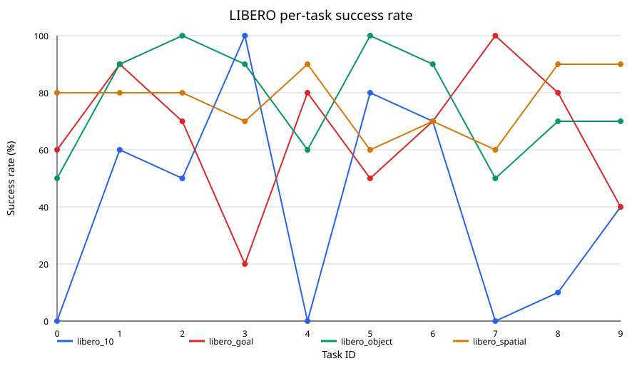
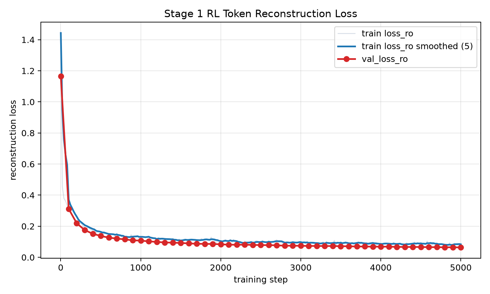

# Step 0：准备数据集和模型权重

说明：本文档只保留关键实验设置、结果和结论。脚本运行报错、TensorRT build/parse 问题、Q/DQ 覆盖断言失败和环境问题已单独整理到 [量化运行问题记录](docs/quantization_runtime_issues.md)。

本项目使用以下 Hugging Face 仓库：

- 数据集：`HuggingFaceVLA/libero`
- 模型权重：`HuggingFaceVLA/smolvla_libero`

先安装 Hugging Face CLI。两个仓库均为公开仓库，可以直接下载；如需更高的下载限额，可先执行可选的登录命令：

```bash
# 可选
HF_ENDPOINT=https://huggingface.co hf auth login

HF_ENDPOINT=https://huggingface.co \
HF_HUB_DOWNLOAD_TIMEOUT=600 \
HF_HUB_ETAG_TIMEOUT=60 \
hf download HuggingFaceVLA/libero \
  --repo-type dataset \
  --revision v3.0 \
  --local-dir /home/evoild/program/smolVLA_mujoco_LIBERO/libero \
  --max-workers 1

HF_ENDPOINT=https://huggingface.co \
HF_HUB_DOWNLOAD_TIMEOUT=600 \
HF_HUB_ETAG_TIMEOUT=60 \
hf download HuggingFaceVLA/smolvla_libero \
  --local-dir /home/evoild/program/smolVLA_mujoco_LIBERO/smolvla_libero \
  --max-workers 1
```

下载支持断点续传。完成后检查必要文件：

```bash
test -f libero/meta/info.json
test -f smolvla_libero/config.json
test -f smolvla_libero/model.safetensors
```

## `smolvla_libero` 的训练方法

根据 [SmolVLA 论文（arXiv:2506.01844）](https://arxiv.org/abs/2506.01844)，论文中的 LIBERO 模型采用以下方法：

- 使用预训练的 `SmolVLM-2` 作为视觉语言骨干，而不是从随机权重训练整个模型。
- 不使用机器人数据预训练权重作为 LIBERO 初始化；在论文 Table 2 中，SmolVLA 的 `VLA Pt` 标记为 `No`。
- 在 LIBERO 的 Spatial、Object、Goal 和 Long 四个 suite、共 40 个任务和 1,693 episodes 上进行多任务训练。
- 冻结 VLM，只训练 action expert。450M 版本约有 100M 参数属于 action expert。
- action expert 使用 flow matching 学习动作分布，一次预测长度为 50 的 action chunk。
- 论文中的仿真训练配置为 100,000 steps、batch size 64；输入图像缩放到 `512×512`。
- 仿真推理时每执行一个动作就重新读取观测并预测，flow-matching 推理使用 10 steps。
- 评测时每个 LIBERO 任务运行 10 次，任务完整完成记为成功。


# Step 1：LIBERO benchmark 评测

使用 SmolVLA 模型在 LIBERO 的 4 个任务套件上进行评测。每个套件包含 10 个任务，每个任务运行 10 个 episode，共评测 400 个 episode。

## 运行命令

```bash
lerobot-eval \
  --policy.path=/home/evoild/program/smolVLA_mujoco_LIBERO/smolvla_libero \
  --policy.device=cuda \
  --env.type=libero \
  --env.task=libero_spatial,libero_object,libero_goal,libero_10 \
  --eval.batch_size=1 \
  --eval.n_episodes=10 \
  --env.max_parallel_tasks=1 \
  --output_dir=/home/evoild/program/smolVLA_mujoco_LIBERO/eval_results/smolvla_libero_4suites
```

该命令未显式传入 seed，使用当前 LeRobot 版本的默认 seed `1000`。

## 评测结果

| 任务套件 | 成功次数 | Episode 数 | 成功率 |
| --- | ---: | ---: | ---: |
| LIBERO-Spatial | 77 | 100 | 77% |
| LIBERO-Object | 77 | 100 | 77% |
| LIBERO-Goal | 66 | 100 | 66% |
| LIBERO-10 | 41 | 100 | 41% |
| **总体** | **261** | **400** | **65.25%** |

评测总耗时约 4.03 小时，平均每个 episode 36.27 秒。

## 可视化

下图展示每个任务的成功率：



详细结果：

- [`summary.csv`](docs/baseline/summary.csv)：各任务套件和总体成功率。
- [`per_task.csv`](docs/baseline/per_task.csv)：40 个具体任务的成功率。
- [`failures.csv`](docs/baseline/failures.csv)：139 个失败 episode 及其回放视频路径。

## 失败案例总结

| 任务套件 | 失败次数 | 失败率 |
| --- | ---: | ---: |
| LIBERO-Spatial | 23 | 23% |
| LIBERO-Object | 23 | 23% |
| LIBERO-Goal | 34 | 34% |
| LIBERO-10 | 59 | 59% |

失败主要集中在以下情况：

- **双物体长时序任务**：LIBERO-10 的 task 0、4、7 成功率为 0%，task 8 为 10%。模型经常只处理第一个物体，无法稳定切换并完成第二个子目标。
- **误差随时间累积**：长任务最多运行 520 steps，早期抓取或放置产生的偏差会影响后续动作，最终运行至超时。
- **精细放置不稳定**：将物体放入抽屉、微波炉、篮子后部或指定盘子时，可能接近目标但未满足成功条件。
- **抓取与重新抓取失败**：部分轨迹中机械臂会在目标附近反复调整，出现抓取偏移、物体滑落或无法恢复的问题。

总体来看，模型的单物体抓取放置能力较好，主要短板是长时序任务中的子目标切换、双物体操作和精细放置。

## Baseline结论

- SmolVLA在Spatial和Object任务上表现较好（77%）。
- Goal任务下降至66%，说明长时序操作开始成为瓶颈。
- LIBERO-10仅41%，说明模型在组合泛化和多阶段规划任务上存在明显性能下降。
- 失败主要来自双物体任务、长时序误差累积和精细放置不稳定。
- 后续工作将通过LoRA微调、冻结策略研究和Action Chunk实验分析模型性能提升空间。

# step 2: RL 微调训练

本阶段目标是在现有 `SmolVLA + LIBERO` 项目中接入 `smollvla_rltoken`，完成可复现的：

```text
Frozen SmolVLA baseline
  -> Stage 1 RL Token reconstruction training
  -> Stage 2 Online RL training
  -> fixed-policy LIBERO evaluation
```

不修改 Step 3 量化部署相关代码；RL 相关改动集中在 `smollvla_rltoken/` 和必要的 LIBERO 接入脚本。

## step 2-0: 当前 RLT smoke test

先确认 RLT 代码能加载当前项目的 LIBERO checkpoint。当前 `smolvla_libero` checkpoint 的输入输出为：

- image keys：`observation.images.image`、`observation.images.image2`
- state dim：8
- action dim：7
- SmolVLA reference chunk：`H=50`
- RLT executed chunk：`C=10`

已将 `smollvla_rltoken` 的 mock/smoke 路径改为从 policy config 自动读取 image keys、state dim 和 action dim，避免沿用旧 SO-100 的 `camera1/2/3`、6 维 action 假设。

运行 smoke test：

```bash
cd /home/evoild/program/smolVLA_mujoco_LIBERO/smollvla_rltoken

/home/evoild/miniconda3/condabin/conda run -n LIBERO-smolvla \
  python scripts/smoke_test.py \
  --checkpoint /home/evoild/program/smolVLA_mujoco_LIBERO/smolvla_libero \
  --device cuda
```

已验证输出：

```text
prefix z=(2,128,960)
reference chunk=(2,50,32)
actor action chunk=(1,10,7)
All smoke tests passed.
```

短 Stage 2 mock 训练入口也已跑通：

```bash
/home/evoild/miniconda3/condabin/conda run -n LIBERO-smolvla \
  python -m rlt.train_online \
  --checkpoint /home/evoild/program/smolVLA_mujoco_LIBERO/smolvla_libero \
  --rl-token /tmp/rlt_random_ckpt/rl_token.pt \
  --mock-env \
  --total-env-steps 30 \
  --warmup-env-steps 10 \
  --batch-size 8 \
  --num-inference-steps 2
```

## step 2-1: LIBERO 接入分析

先不改 Algorithm 1 主体，先整理 `docs/rlt_libero_integration_analysis.md`，明确以下链路：

```text
LIBERO observation
        ↓
SmolVLA processor
        ↓
prefix hidden z_{1:M}
        ↓
RL Token Encoder
        ↓
z_rl
        ↓
Actor(z_rl, proprio, reference_action)
        ↓
RL action chunk
        ↓
LIBERO env.step
        ↓
reward / done / next_obs
        ↓
Replay Buffer
        ↓
Actor-Critic update
```

需要确认：

- LeRobot 当前如何创建 LIBERO env。
- observation 的 image/state/language key 和 tensor shape。
- SmolVLA processor、normalizer、unnormalizer 的调用位置。
- `predict_action_chunk()` / flow matching / prefix hidden 的调用链。
- action normalization / unnormalization。
- episode termination、truncation 和 LIBERO success 判定。
- RLT `ChunkEnv`、`RLTController`、`train_online.py` 对 env 的具体要求。

## step 2-2: 实现 `LiberoChunkEnv`

状态：已完成。

新增 `smollvla_rltoken/rlt/libero_env.py`，实现现有 `ChunkEnv` 协议：

```python
reset()
step(action_chunk)
obs_to_batch(obs)
get_intervention()
```

实现原则：

- `obs_to_batch()` 必须复用当前 SmolVLA/LeRobot 的 processor 和 preprocessing 逻辑，禁止另写一套图像、state、language、normalization 处理。
- actor 输出的是 chunk，但 LIBERO env 按单步 action 执行，因此 `step(action_chunk)` 内部逐 action 调用 `env.step(action)`。
- 每次执行最多 `C=10` 步；遇到 terminated、truncated 或 success 立即提前结束。
- 每执行完一个 RLT chunk 后重新读取 observation，重新计算 `z_rl`、reference chunk 和 actor action。

实际实现中保持现有 `RolloutWorker` 协议：`LiberoChunkEnv.step(action)` 只执行单个 normalized action，chunk 循环仍由 `RolloutWorker` 负责，避免 env 内部和 worker 双重循环。

新增内容：

- `smollvla_rltoken/rlt/libero_env.py`
  - 直接包装 LeRobot `LiberoEnv` / LIBERO `OffScreenRenderEnv`。
  - `obs_to_batch()` 复用 `preprocess_observation`、`LiberoProcessorStep` 和 checkpoint 内 SmolVLA preprocessor。
  - `step()` 在执行前复用 checkpoint postprocessor，把 RLT normalized action unnormalize 到 LIBERO env action。
  - sparse reward：`reward = 1.0 if info["is_success"] else 0.0`。
- `smollvla_rltoken/rlt/train_online.py`
  - 新增 `--libero-env`、`--libero-suite`、`--libero-task-id` 等参数。
  - 保留 `--mock-env` 原路径。
  - `RolloutWorker` 兼容 env 的 `last_success`，区分 episode done 和真实 LIBERO success。

已验证 `LiberoChunkEnv` 可以完成：

```text
reset
  -> obs_to_batch
  -> SmolVLA/RLT batch keys
  -> postprocess normalized action
  -> LIBERO env.step
```

验证命令：

```bash
cd /home/evoild/program/smolVLA_mujoco_LIBERO/smollvla_rltoken

/home/evoild/miniconda3/condabin/conda run -n LIBERO-smolvla \
  python -m rlt.train_online \
  --checkpoint /home/evoild/program/smolVLA_mujoco_LIBERO/smolvla_libero \
  --rl-token /tmp/rlt_random_ckpt/rl_token.pt \
  --libero-env \
  --libero-suite libero_spatial \
  --libero-task-id 0 \
  --total-env-steps 2 \
  --warmup-env-steps 2 \
  --batch-size 8 \
  --num-inference-steps 2 \
  --max-episode-steps 5 \
  --log-freq 1 \
  --out /tmp/rlt_libero_env_smoke
```

短 rollout 已跑通，输出示例：

```text
[stage2] steps=5 eps=1 buffer=3 success20=0.00
[stage2] done; 1 episodes, saved to /tmp/rlt_libero_env_smoke/rlt_agent.pt
```

## step 2-3: Frozen VLA + RLT inference smoke test

状态：已完成。

新增：

```text
scripts/test_rlt_libero_rollout.py
```

先只跑 1 个 LIBERO task、3 个 episodes，不训练 Actor/Critic，只验证真实 LIBERO rollout 链路：

```text
LIBERO observation
  -> frozen SmolVLA
  -> prefix hidden
  -> z_rl
  -> reference action
  -> actor action
  -> LIBERO env.step
```

检查项：

- prefix hidden shape
- `z_rl` shape
- reference action shape
- actor action shape
- action 是否包含 NaN / Inf
- action range 是否合理
- episode 是否能正常 terminate / truncate
- success 是否能正确读取

实现位置：

```text
smollvla_rltoken/scripts/test_rlt_libero_rollout.py
```

该脚本只做 inference 和 env rollout，不做任何 Actor/Critic/RL-token 梯度更新。若未传入 `--rl-token`，脚本会创建随机初始化的 `RLTokenModule`，用于验证真实 LIBERO 接口和 RLT 前向 plumbing；Stage 1 完成后应传入训练好的 `rl_token.pt`。

验证命令：

```bash
cd /home/evoild/program/smolVLA_mujoco_LIBERO/smollvla_rltoken

/home/evoild/miniconda3/condabin/conda run -n LIBERO-smolvla \
  python scripts/test_rlt_libero_rollout.py \
  --checkpoint /home/evoild/program/smolVLA_mujoco_LIBERO/smolvla_libero \
  --device cuda \
  --suite libero_spatial \
  --task-id 0 \
  --episodes 3 \
  --max-episode-steps 5 \
  --num-inference-steps 2 \
  --execute actor
```


## step 2-4: Stage 1 RL Token reconstruction training


使用当前项目一致的 checkpoint 和 dataset：

```text
checkpoint: /home/evoild/program/smolVLA_mujoco_LIBERO/smolvla_libero
dataset: /home/evoild/program/smolVLA_mujoco_LIBERO/libero
suite: libero_goal
dataset task_index: 10-19
```

训练目标：

```text
SmolVLA frozen
  -> prefix final hidden z_{1:M}
  -> RL Token encoder
  -> z_rl
  -> decoder reconstruct sg(z)
```

第一阶段不联合 SFT VLA：

```text
vla_sft_alpha = 0
```

输出目录：

```text
outputs/rlt_libero/stage1_goal_fixed/
```

记录指标：

- train reconstruction loss
- validation reconstruction loss
- `z_rl` norm
- gradient norm
- training time
- GPU memory

实现位置：

```text
smollvla_rltoken/rlt/train_rl_token.py
```

当前 targeted repair 实验的 Stage 1 训练范围：

```text
train suite: libero_goal
dataset task_index: 10-19
target repair suite task_id for Stage 2: 3, 9
guardrail suite task_id: 0, 1, 2, 4, 5, 6, 7, 8
```

说明：Stage 1 是 RL Token reconstruction pretraining，不直接优化 success。为了后续证明
suite task 3/9 的成功率提升且其它 task 不掉点，这一步应覆盖 `libero_goal` 全 10 个 task；
只在 Stage 2 online RL 中把 3/9 作为重点采样和奖励优化对象。Stage 2 评估必须同时报告
3/9 与其它 8 个 guardrail tasks 的 per-task success rate。


正式训练命令：

```bash
cd /home/evoild/program/smolVLA_mujoco_LIBERO/smollvla_rltoken

HF_HUB_OFFLINE=1 TRANSFORMERS_OFFLINE=1 HF_DATASETS_CACHE=/tmp/hf_datasets_cache \
  python -m rlt.train_rl_token \
  --checkpoint /home/evoild/program/smolVLA_mujoco_LIBERO/smolvla_libero \
  --dataset HuggingFaceVLA/libero \
  --dataset-root /home/evoild/program/smolVLA_mujoco_LIBERO/libero \
  --dataset-suite libero_goal \
  --device cuda \
  --steps 5000 \
  --batch-size 8 \
  --num-workers 4 \
  --vla-sft-alpha 0.0 \
  --val-ratio 0.1 \
  --val-freq 100 \
  --val-batches 4 \
  --log-freq 20 \
  --save-freq 500 \
  --out /home/evoild/program/smolVLA_mujoco_LIBERO/outputs/rlt_libero/stage1_goal_fixed
```

正式训练完成后检查：

```bash
cat /home/evoild/program/smolVLA_mujoco_LIBERO/outputs/rlt_libero/stage1_goal_fixed/summary.json
tail -n 5 /home/evoild/program/smolVLA_mujoco_LIBERO/outputs/rlt_libero/stage1_goal_fixed/metrics.jsonl
```

修正后正式训练已完成：

```text
output: /home/evoild/program/smolVLA_mujoco_LIBERO/outputs/rlt_libero/stage1_goal_fixed
steps: 5000
dataset_suite: libero_goal
dataset_task_indices: [10, 11, 12, 13, 14, 15, 16, 17, 18, 19]
train_episodes: 385
val_episodes: 43
elapsed_s: 1229.78
gpu_peak_mem_mb: 1761.92
```

最终指标：

```text
loss_ro: 1.44327 -> 0.07426
last10 loss_ro mean: 0.08235
val_loss_ro: 1.16488 -> 0.06356
grad_norm final: 0.16808
z_rl_norm final: 22.66667
throughput final: 4.07 it/s
```

输出文件：

```text
rl_token.pt        57.4 MB
metrics.jsonl      251 log rows
summary.json
tensorboard/events.out.tfevents.1787805679.evoild-ubuntu.45377.0
loss_curve_train_val.png
```

Stage 1 train/val reconstruction loss 曲线：




曲线结论：

```text
train points: 251
val points: 51
loss_ro: 1.443269 -> 0.074257
val_loss_ro: 1.164880 -> 0.063564
```

训练和验证 loss 同步下降，最终 `val_loss_ro` 没有高于 `loss_ro`，当前没有明显 reconstruction
过拟合迹象。该图只能证明 Stage 1 表征重构训练收敛；是否提升 LIBERO success 仍需看 Stage 2
online RL 和 Step 2-7 fixed-policy eval。

## step 2-5: Stage 2 LIBERO Online RL

状态：入口已完成，`libero_goal` task 3/9 residual actor 短 smoke 已通过。

冻结：

```text
SmolVLA
RL Token encoder
```

只训练：

```text
Actor
Twin Critic
```

沿用现有 RLT 的 TD3-style Twin Q、min-Q target、BC regularization、reference action、Replay Buffer 和 UTD update。第一阶段不加 human intervention。

奖励先使用 LIBERO sparse reward：

```text
success = 1
otherwise = 0
```

不加入未经验证的 dense reward。

实现位置：

```text
smollvla_rltoken/rlt/train_online.py
```

已补齐：

- `--libero-task-ids 3,9`：在 episode 边界循环多个 LIBERO task，用同一个 Actor/Critic 做 targeted repair。
- `metrics.jsonl`：记录 episode return/success/task_id、buffer size、critic/actor 更新指标、`delta_l2` 和 `actor_ref_l2`。
- `summary.json`：记录 suite、task ids、env steps、episodes、success rate、Stage 1 RL Token checkpoint。
- `rlt_agent.pt`：保存 Actor/Critic/target/optimizer 状态。

使用 Stage 1 产物：

```text
/home/evoild/program/smolVLA_mujoco_LIBERO/outputs/rlt_libero/stage1_goal_fixed/rl_token.pt
```

GPU 正式训练命令模板：

```bash
cd /home/evoild/program/smolVLA_mujoco_LIBERO/smollvla_rltoken

HF_HUB_OFFLINE=1 TRANSFORMERS_OFFLINE=1 HF_DATASETS_CACHE=/tmp/hf_datasets_cache \
MPLCONFIGDIR=/tmp/matplotlib NUMBA_DISABLE_JIT=1 \
/home/evoild/miniconda3/condabin/conda run --no-capture-output -n LIBERO-smolvla \
  python -m rlt.train_online \
  --checkpoint /home/evoild/program/smolVLA_mujoco_LIBERO/smolvla_libero \
  --rl-token /home/evoild/program/smolVLA_mujoco_LIBERO/outputs/rlt_libero/stage1_goal_fixed/rl_token.pt \
  --libero-env \
  --libero-suite libero_goal \
  --libero-task-ids 3,9 \
  --device cuda \
  --total-env-steps 20000 \
  --warmup-env-steps 2000 \
  --batch-size 256 \
  --utd 5 \
  --chunk-len 10 \
  --num-inference-steps 2 \
  --max-episode-steps 400 \
  --log-freq 200 \
  --save-freq 2000 \
  --out /home/evoild/program/smolVLA_mujoco_LIBERO/outputs/rlt_libero/stage2_goal_3_9_fixed
```


训练期 episode success：

```text
all episodes:
  task 3: 33/43 = 76.7%
  task 9: 24/43 = 55.8%
  total: 57/86 = 66.3%

post-warmup episodes:
  task 3: 29/39 = 74.4%
  task 9: 24/40 = 60.0%
  total: 53/79 = 67.1%

last 20 episodes:
  task 3: 8/10 = 80.0%
  task 9: 5/10 = 50.0%
  total: 13/20 = 65.0%
```

最后阶段训练指标：

```text
critic_loss last10 mean: 0.000127
q_mean last10 mean: 0.12481
target_mean last10 mean: 0.12499
actor_loss last logged: -0.14162
bc_dist last logged: 0.01323
delta_l2 last logged: 0.16968
actor_ref_l2 last logged: 0.23637
throughput final: 31.47 steps/s
```

输出文件：

```text
rlt_agent.pt
metrics.jsonl
summary.json
```

结论：fixed Stage 2 已使用正确的 fixed Stage 1 RL Token。训练期 task 3 明显高于
Frozen SmolVLA baseline 的 `30%`；task 9 训练期约 `56-60%`，接近/略低于本轮
Frozen baseline eval 的 `60%`。这只是在线训练期间的统计，不能替代 guardrail eval；
下一步必须用 Step 2-7 固定 Actor 重新评估 `libero_goal` 0-9，确认 task 3/9 提升是否
导致其它 task 掉点。

## step 2-6: 解决 cold-start

状态：已完成。Actor 已改为 zero-init residual actor。

不要让随机初始化 Actor 直接控制 LIBERO。优先实现 residual actor：

```text
actor_action = reference_action + delta_action
```

要求：

- `delta_action` output layer zero initialization。
- 初始时 `actor_action ≈ SmolVLA reference_action`。
- 保留 BC regularization：`L_actor = -Q + beta * L_BC`。
- 记录 `||delta_action||` 和 `||actor_action - reference_action||`。

实现位置：

```text
smollvla_rltoken/rlt/actor_critic.py
smollvla_rltoken/rlt/rlt_policy.py
smollvla_rltoken/rlt/train_online.py
```

实现细节：

- `ChunkActor` 预测 `delta_action`，动作均值为 `ref_chunk + delta_action`。
- Actor 最后一层 `Linear` 的 weight/bias zero initialization。
- reference dropout 只作用于 `delta_action` 网络输入，不作用于 residual skip。
- deterministic 初始 actor 满足 `actor.mu(x, ref) == ref`。
- rollout 和 update 日志记录 `rollout_delta_l2`、`rollout_actor_ref_l2`、`delta_l2`、`actor_ref_l2`。

已验证：

```text
max_mu_ref_abs 0.0
max_delta_abs 0.0
```

Stage 2 residual smoke 输出中，warmup chunk 的 rollout residual 距离为 0：

```text
"rollout_actor_ref_l2": 0.0
"rollout_delta_l2": 0.0
```
 
## step 2-7: 实验设计与评测

状态：guardrail eval 脚本已完成，短 smoke 已通过。

当前目标不是再训练，而是验证 task 3/9 的提升是否以其它 `libero_goal` task 掉点为代价。
评估范围固定为 `libero_goal` 的 suite task id `0-9`：

```text
target tasks: 3, 9
guardrail tasks: 0, 1, 2, 4, 5, 6, 7, 8
```

LIBERO env 中这两个 target task 的真实描述是：

```text
task 3: open the top drawer and put the bowl inside
task 9: put the wine bottle on the rack
```

至少建立三个 baseline：

| 方案 | 目的 |
| --- | --- |
| Frozen SmolVLA | 原始模型基准 |
| Frozen SmolVLA + untrained residual Actor | 验证 zero-init 后成功率应接近 SmolVLA |
| SmolVLA + trained RLT Actor | RL 后训练结果 |

训练记录：

- episode return
- episode success
- success rate moving average
- critic Q mean
- critic loss
- actor loss
- BC loss
- `||actor - reference||`
- `||delta_action||`
- replay buffer size
- UTD updates

评测时固定 Actor，不做 gradient update。最终至少运行 100 evaluation episodes，输出：

```text
baseline success rate
RLT success rate
absolute improvement percentage points
```

同时保留 successful / failed episode video，用于 failure analysis。

实现位置：

```text
smollvla_rltoken/scripts/eval_rlt_libero_guardrail.py
```

输出文件：

```text
episodes.csv
per_task.csv
summary.json
videos/  # 仅加 --save-videos 时生成
```

Frozen SmolVLA baseline 评估：

```bash
cd /home/evoild/program/smolVLA_mujoco_LIBERO/smollvla_rltoken

HF_HUB_OFFLINE=1 TRANSFORMERS_OFFLINE=1 HF_DATASETS_CACHE=/tmp/hf_datasets_cache \
MPLCONFIGDIR=/tmp/matplotlib NUMBA_DISABLE_JIT=1 \
/home/evoild/miniconda3/condabin/conda run --no-capture-output -n LIBERO-smolvla \
  python scripts/eval_rlt_libero_guardrail.py \
  --checkpoint /home/evoild/program/smolVLA_mujoco_LIBERO/smolvla_libero \
  --rl-token /home/evoild/program/smolVLA_mujoco_LIBERO/outputs/rlt_libero/stage1_goal_fixed/rl_token.pt \
  --suite libero_goal \
  --task-ids 0,1,2,3,4,5,6,7,8,9 \
  --episodes-per-task 100 \
  --max-episode-steps 400 \
  --chunk-len 10 \
  --num-inference-steps 2 \
  --device cuda \
  --out /home/evoild/program/smolVLA_mujoco_LIBERO/outputs/rlt_libero/eval_goal_baseline
```

RLT actor 评估：

```bash
cd /home/evoild/program/smolVLA_mujoco_LIBERO/smollvla_rltoken

HF_HUB_OFFLINE=1 TRANSFORMERS_OFFLINE=1 HF_DATASETS_CACHE=/tmp/hf_datasets_cache \
MPLCONFIGDIR=/tmp/matplotlib NUMBA_DISABLE_JIT=1 \
/home/evoild/miniconda3/condabin/conda run --no-capture-output -n LIBERO-smolvla \
  python scripts/eval_rlt_libero_guardrail.py \
  --checkpoint /home/evoild/program/smolVLA_mujoco_LIBERO/smolvla_libero \
  --rl-token /home/evoild/program/smolVLA_mujoco_LIBERO/outputs/rlt_libero/stage1_goal_fixed/rl_token.pt \
  --agent /home/evoild/program/smolVLA_mujoco_LIBERO/outputs/rlt_libero/stage2_goal_3_9_fixed/rlt_agent.pt \
  --suite libero_goal \
  --task-ids 0,1,2,3,4,5,6,7,8,9 \
  --episodes-per-task 100 \
  --max-episode-steps 400 \
  --chunk-len 10 \
  --num-inference-steps 2 \
  --device cuda \
  --out /home/evoild/program/smolVLA_mujoco_LIBERO/outputs/rlt_libero/eval_goal_rlt
```

加 `--save-videos` 可以保存每个 episode 的 mp4，但会显著增加磁盘和耗时。正式 failure
analysis 时建议只对 task 3/9 或失败 episode 复跑加视频。

正式 100 episodes/task 评估结果：

```text
baseline: /home/evoild/program/smolVLA_mujoco_LIBERO/outputs/rlt_libero/eval_goal_baseline
RLT:      /home/evoild/program/smolVLA_mujoco_LIBERO/outputs/rlt_libero/eval_goal_rlt
```

整体结果：

| Split | Baseline | RLT | Delta |
| --- | ---: | ---: | ---: |
| target task 3/9 mean | 48.0% | 34.0% | -14.0 pp |
| guardrail task mean | 87.0% | 86.9% | -0.1 pp |
| all libero_goal | 79.2% | 76.3% | -2.9 pp |

per-task 结果：

| task_id | Task | Baseline | RLT | Delta |
| ---: | --- | ---: | ---: | ---: |
| 0 | open the middle drawer of the cabinet | 72.0% | 80.0% | +8.0 pp |
| 1 | put the bowl on the stove | 97.0% | 95.0% | -2.0 pp |
| 2 | put the wine bottle on top of the cabinet | 87.0% | 85.0% | -2.0 pp |
| 3 | open the top drawer and put the bowl inside | 45.0% | 37.0% | -8.0 pp |
| 4 | put the bowl on top of the cabinet | 96.0% | 93.0% | -3.0 pp |
| 5 | push the plate to the front of the stove | 87.0% | 84.0% | -3.0 pp |
| 6 | put the cream cheese in the bowl | 82.0% | 86.0% | +4.0 pp |
| 7 | turn on the stove | 96.0% | 97.0% | +1.0 pp |
| 8 | put the bowl on the plate | 79.0% | 75.0% | -4.0 pp |
| 9 | put the wine bottle on the rack | 51.0% | 31.0% | -20.0 pp |

结论：这次 RLT 后训练没有证明 targeted repair。好的一点是 guardrail tasks 基本没有整体掉点
（-0.1 pp），说明对其它 `libero_goal` task 的负迁移很小；但目标 task 3/9 平均下降
14.0 pp，尤其 task 9 明显退化。因此当前 checkpoint 不应作为成功结果，只能作为
negative result。下一轮应降低 Actor 偏离 reference 的幅度，例如提高 `bc_beta`、降低
`action_std`、缩短训练步数，或把 task 3/9 与 guardrail tasks 混合训练后再评估。

fixed Stage 2 guardrail eval 已完成：

```text
baseline output: /home/evoild/program/smolVLA_mujoco_LIBERO/outputs/rlt_libero/eval_goal_baseline
RLT output: /home/evoild/program/smolVLA_mujoco_LIBERO/outputs/rlt_libero/eval_goal_rlt
episodes: 200 each
episodes_per_task: 20
```

补充：`eval_goal_baseline` 后续被 100 episodes/task 的 frozen reference 复跑覆盖。当前该目录
中的 baseline summary 为：

```text
output: /home/evoild/program/smolVLA_mujoco_LIBERO/outputs/rlt_libero/eval_goal_baseline
mode: frozen_reference
episodes: 1000
episodes_per_task: 100
successes: 792
success_rate: 79.2%
elapsed_s: 3007.32
```

100 episodes/task baseline per-task：

| task | task description | Frozen success |
| ---: | --- | ---: |
| 0 | open the middle drawer of the cabinet | 72/100 = 72% |
| 1 | put the bowl on the stove | 97/100 = 97% |
| 2 | put the wine bottle on top of the cabinet | 87/100 = 87% |
| 3 | open the top drawer and put the bowl inside | 45/100 = 45% |
| 4 | put the bowl on top of the cabinet | 96/100 = 96% |
| 5 | push the plate to the front of the stove | 87/100 = 87% |
| 6 | put the cream cheese in the bowl | 82/100 = 82% |
| 7 | turn on the stove | 96/100 = 96% |
| 8 | put the bowl on the plate | 79/100 = 79% |
| 9 | put the wine bottle on the rack | 51/100 = 51% |

100 episodes/task baseline 分组：

```text
target tasks 3/9:
  Frozen: 96/200 = 48.0%

guardrail tasks 0/1/2/4/5/6/7/8:
  Frozen: 696/800 = 87.0%

overall:
  Frozen: 792/1000 = 79.2%
```

这次更长 baseline 与 20 episodes/task baseline 的 `79.5%` 很接近，说明在当前
guardrail 脚本口径下 frozen reference 大约稳定在 `79-80%`。但它仍然不是 Step 1
`lerobot-eval` 口径的 `66%`，主要结果报告前仍需统一评测入口。当前 RLT 输出目录是
50 episodes/task，不能和这个 100 episodes/task baseline 直接做最终 A/B 结论。

注意：下面结果是 `scripts/eval_rlt_libero_guardrail.py` 的固定 Actor 评测口径，不是 Step 1
的 `lerobot-eval` 原始口径。Step 1 中 `LIBERO-Goal` 的 frozen SmolVLA baseline 是
`66/100 = 66%`；这里 guardrail 脚本重新评估 frozen reference 得到 `159/200 = 79.5%`，
说明两套评测链路存在口径差异，不能直接把这里的 79.5% 当作 Step 1 baseline。Step 2-7
当前只能用于同一脚本内的 A/B 对比，也就是比较同一 `LiberoChunkEnv + RLTController`
链路下的 frozen reference 与 RLT actor。

口径对照：

| evaluation path | policy mode | successes | episodes | success rate | note |
| --- | --- | ---: | ---: | ---: | --- |
| Step 1 `lerobot-eval` | SmolVLA baseline | 66 | 100 | 66.0% | README Step 1 / `docs/baseline` |
| Step 2-7 guardrail script | frozen reference | 159 | 200 | 79.5% | RLT eval wrapper, seed/defaults differ |
| Step 2-7 guardrail script | RLT actor | 161 | 200 | 80.5% | same wrapper as frozen reference |

Step 2-7 同脚本 A/B 结果：

```text
Frozen SmolVLA: 159/200 = 79.5%
RLT actor:      161/200 = 80.5%
delta:          +1.0 percentage point
```

per-task 结果：

| task | task description | Frozen | RLT | delta |
| ---: | --- | ---: | ---: | ---: |
| 0 | open the middle drawer of the cabinet | 75% | 95% | +20 |
| 1 | put the bowl on the stove | 100% | 95% | -5 |
| 2 | put the wine bottle on top of the cabinet | 80% | 95% | +15 |
| 3 | open the top drawer and put the bowl inside | 55% | 40% | -15 |
| 4 | put the bowl on top of the cabinet | 95% | 100% | +5 |
| 5 | push the plate to the front of the stove | 95% | 80% | -15 |
| 6 | put the cream cheese in the bowl | 90% | 95% | +5 |
| 7 | turn on the stove | 95% | 100% | +5 |
| 8 | put the bowl on the plate | 65% | 55% | -10 |
| 9 | put the wine bottle on the rack | 45% | 50% | +5 |

分组结果：

```text
target tasks 3/9:
  Frozen: 20/40 = 50.0%
  RLT:    18/40 = 45.0%
  delta:  -5.0 points

guardrail tasks 0/1/2/4/5/6/7/8:
  Frozen: 139/160 = 86.9%
  RLT:    143/160 = 89.4%
  delta:   +2.5 points
```

结论：20 episodes/task 后，当前 fixed Stage 2 配置的 overall 从 `79.5%` 到 `80.5%`，guardrail
从 `86.9%` 到 `89.4%`，没有出现整体掉点；但 targeted repair 仍未成立。目标 task 3/9 平均从
`50.0%` 降到 `45.0%`，其中 task 3 从 `55%` 降到 `40%`，task 9 只从 `45%` 到 `50%`。
因此这轮结果最多说明 RLT actor 在该 guardrail 脚本口径下没有明显损伤整体成功率，但不能证明
“RL 后训练修复 task 3/9 特定失败”。

同时，由于 Step 2-7 frozen reference 的 `79.5%` 与 Step 1 `lerobot-eval` 的 `66%` 不一致，后续
若要写论文/报告中的主结果，必须先统一评测入口。推荐增加一个 `lerobot-eval` 兼容的 RLT
policy wrapper，或让 guardrail 脚本严格复刻 Step 1 的 seed、episode sampling、action selection
和 environment 参数后再报告最终数字。

诊断：

```text
task 9 actor_ref_l2_mean: 0.1704
task 3 actor_ref_l2_mean: 0.1595
task 4 actor_ref_l2_mean: 0.2316
```

Actor 已经明显偏离 reference，但这种偏移没有带来 eval success 提升。下一轮不应继续扩大训练步数，
应先加强保守约束：

```text
bc_beta: 1.0 -> 2.0 或 5.0
action_std: 0.05 -> 0.02
utd: 5 -> 2
total_env_steps: 20000 -> 10000
```

更稳妥的下一组实验是保留 `stage1_goal_fixed/rl_token.pt`，重新跑 Stage 2：

```text
outputs/rlt_libero/stage2_goal_3_9_fixed_bc5_std002_utd2
```

# step 3: 量化部署
## step 3-1: baseline
### A. 模型结构和实验基准
| 模块 | 精度 | 
| --- | ---: | 
| vlm_with_expert.vlm | bf16 |
| vlm_with_expert.lm_expert | fp32 |
| state_proj | fp32 |
| action_in_proj | fp32 |
| action_out_proj | fp32 |
| action_time_mlp_in | fp32 |
| action_time_mlp_out | fp32 |

从结构上来说，smolvla的action_head通过ode多步迭代生成动作，对其进行量化会带入过大的误差，因此主要对vlm部分进行量化。\
分析vlm内部各模块在forward中的消耗时间占比，FNN和muti-head attention的线性层计算占用了最主要的计算量，确定主要量化目标网络。

| 方案 | 设备 | Batch | 部署入口 | 平均延迟 | P95 延迟 | FPS | 峰值显存 | Engine Size | Success Rate |
| --- | --- | ---: | --- | ---: | ---: | ---: | ---: | ---: | ---: |
| BF16 action-only TensorRT baseline | RTX 5070 Ti | 1 | `policy.predict_action_chunk` | 44.677 ms | 45.995 ms | 22.383 | 1222.929 MB | 1793.483 MB | 70.0% |


 `libero_goal` 模块耗时如下，仅作为历史记录。这里 `unattributed` 是端到端耗时中没有归入下列
`nn.Module` hook 的部分，主要包括
functional attention、mask 构造、tensor 拼接、loss 计算等非模块调用。

| 模块 | 平均耗时 | P95 耗时 | 占端到端延迟 |
| --- | ---: | ---: | ---: |
| `vlm` | 15.01 ms | 15.41 ms | 36.66% |
| `lm_expert` | 6.34 ms | 6.51 ms | 15.48% |
| `state_proj` | 0.02 ms | 0.03 ms | 0.06% |
| `action_in_proj` | 0.02 ms | 0.03 ms | 0.06% |
| `action_time_mlp` | 0.05 ms | 0.05 ms | 0.11% |
| `action_out_proj` | 0.02 ms | 0.03 ms | 0.06% |
| `unattributed` | 19.49 ms | 19.72 ms | 47.58% |


主要瓶颈是 `unattributed` 部分和 `vlm`：两者合计约占端到端 `policy.forward` 延迟的 84.24%。线性投影层和 action MLP 的耗时都在 0.1 ms 以下，不是当前 baseline 的主要性能瓶颈。


从结构上来说，smolvla的action_head通过ode多步迭代生成动作，对其进行量化会带入过大的误差，因此主要对vlm部分进行量化。\
分析vlm内部各模块在forward中的消耗时间占比，FNN和muti-head attention的线性层计算占用了最主要的计算量，确定主要量化目标网络。

### B. 实验构建、分析和排查
构建对比矩阵：fake-quant

| 对比 | 目的 |
| --- | --- |
| A. PyTorch native vs B. PyTorch fake quant | 判断量化算法本身的误差 |
| B. PyTorch fake quant vs C. TensorRT engine | 判断 TensorRT Q/DQ 实现是否与 fake quant 等价 |
| A. PyTorch native vs C. TensorRT engine | 判断总部署误差，进行量化性能比较 |

A vs B: 先通过 PyTorch fake quant 隔离量化算法误差；只有当量化后的 action、Flow Matching 中间状态以及 rollout 精度满足要求时，才导出 explicit Q/DQ ONNX 并构建 TensorRT engine。\
B vs C: 随后比较 TensorRT engine 与 fake quant 输出，验证 Q/DQ、scale 和 TensorRT kernel 对量化算法的实现等价性。\
A vs C: 最后以 native PyTorch 为基线，对 TensorRT engine 进行最终动作误差、任务成功率、推理延迟、吞吐量和资源占用评测。

1. 不量化action head，避免多步ode引入误差。
2. 校准和测试用对应的场景数据而不是合成数据，对sample数量可以进行sweep。
3. 诊断应改用完全ode后生成的动作结果来做为判断，而不是一次vlm的forward结果。同时加以中间网络的输出误差来作为诊断。判断误差来源： 敏感层？ ode迭代误差？ 网络结构性放大？定位误差是在 prefix/KV cache 阶段出现，还是在 ODE 多步迭代中逐步放大。

### C. 初步排查
1. `--precisionConstraints=obey` 强制 TensorRT 遵守 ONNX mixed precision之外，其余构建参数保持默认 BF16 engine 的方式。
2. `--builderOptimizationLevel=0` 减少 Builder 优化变量，让 Engine 更快构建，方便反复实验。最终性能结论。应该固定相同的 Builder 设置，用默认/较高优化级别重新构建 BF16 和 INT8 Engine，再公平比较 latency。
3. 量化节点范围: 不是量化所有linear，而是FFN和attention projection的linear。
4. 定位到 down_proj 作为敏感层，w8A16远高于w8a8。
5. 根据算法比如使用max_min来确定定位关键层，不能只注重activation平均的clipping ratio，还要关注outlier和activation的分布情况。
6. 误差是来自量化还是结构的问题，分别怎么解决。
## step 3-2: 优化量化

### A. down_proj W8A8 vs w8a16

| 项目 | 设置 |
| --- | --- |
| task suite | `libero_spatial` |
| seed | `1000` |
| input dtype | `fp32` |
| calibration samples | `32` |
| calibration percentile | `p99.99` |
| quantized modules | `model.vlm_with_expert.vlm.model.text_model.layers.*.mlp.down_proj` |
| matched down modules | `32` |
| near zero threshold | `1e-6` |
| meaningful sign flip threshold | `1e-3` |

最终 action chunk 对比：

| 对比 | cosine | relative_l2_error | l2_norm_ratio | std_ratio | MAE | RMSE | max_abs_error |
| --- | ---: | ---: | ---: | ---: | ---: | ---: | ---: |
| Baseline vs down W8A16 | `0.9987047315` | `0.0511955097` | `0.9930145741` | `0.9969357252` | `0.0109421164` | `0.0270873141` | `0.4334584177` |
| Baseline vs down W8A8 | `0.7286839485` | `0.9009160399` | `1.3140305281` | `1.3464869261` | `0.2918129265` | `0.4766706526` | `1.9523823261` |

判读：`down_proj` 的 weight-only W8A16 误差很小，而 W8A8 误差突然放大。因此当前 `down_proj` 的主要问题不是 weight INT8，而是 activation A8。


只量化 down W8A8 时，误差在 denoise steps 中明显累积：

| step | v_t cosine | v_t rel L2 | x_t cosine | x_t rel L2 |
| ---: | ---: | ---: | ---: | ---: |
| `0` | `0.9829221368` | `0.1854999661` | `0.9997686148` | `0.0215622969` |
| `1` | `0.9840773344` | `0.1799227595` | `0.9988996983` | `0.0470644757` |
| `2` | `0.9846588969` | `0.1778031737` | `0.9969863296` | `0.0780076310` |
| `3` | `0.9840828180` | `0.1822075993` | `0.9931949973` | `0.1176518574` |
| `4` | `0.9824244380` | `0.1918895394` | `0.9857891798` | `0.1713840067` |
| `5` | `0.9792337418` | `0.2083165497` | `0.9712370038` | `0.2480731308` |
| `6` | `0.9707043767` | `0.2467421591` | `0.9424557090` | `0.3631194830` |
| `7` | `0.9479514956` | `0.3283734620` | `0.8866587281` | `0.5404633880` |
| `8` | `0.9190528393` | `0.4091812670` | `0.8013168573` | `0.7634900808` |
| `9` | `0.8920488358` | `0.4702385962` | `0.7288161516` | `0.9001781940` |

判读：step 0 的 `x_t relative_l2_error` 只有 `0.0216`，但到 step 9 增长到 `0.9002`。这说明 down W8A8 的误差不是只在最后一次前向里体现，而是在 Flow Matching / ODE denoise 多步中持续累积放大。

### B. down_proj 重新 calibration + held-out 验证


Held-out 结果随 calibration 样本数增加明显改善：

| samples | action L2 | action cosine | first action L2 | v_t step09 L2 | x_t step09 L2 | mean clip | max channel clip | sign flip |
| ---: | ---: | ---: | ---: | ---: | ---: | ---: | ---: | ---: |
| `32` | `0.1423149708` | `0.9854448736` | `0.1658860885` | `0.1248293370` | `0.1424100802` | `0.0004547940` | `0.2033898234` | `0.0282081528` |
| `64` | `0.0723364342` | `0.9961576426` | `0.0680550103` | `0.0719006050` | `0.0725043438` | `0.0002099596` | `0.1977401078` | `0.0145313440` |
| `128` | `0.0588635414` | `0.9972519398` | `0.0546209538` | `0.0588546607` | `0.0590295260` | `0.0000957542` | `0.1920903921` | `0.0122451461` |
| `256` | `0.0488056355` | `0.9977478290` | `0.0384833270` | `0.0583312462` | `0.0490013506` | `0.0000421343` | `0.1864406765` | `0.0093256030` |
| `512` | `0.0439390303` | `0.9979647160` | `0.0290826556` | `0.0525341382` | `0.0441346704` | `0.0000233478` | `0.1864406765` | `0.0080658395` |

判读：

1. 从 `32 -> 512`，held-out action relative L2 从 `0.1423` 降到 `0.0439`，下降约 `69.1%`。
2. meaningful sign flip rate 从 `2.82%` 降到 `0.81%`。
3. mean clipping rate 从 `4.55e-4` 降到 `2.33e-5`，说明增加 calibration coverage 明显改善了大部分 channel 的范围估计。
4. max channel clipping rate 仍然保持在约 `18.64%`，说明还有少数 channel 仍存在极端 range mismatch 或 outlier，但它们对整体 action 的影响已经显著下降。


相对 4A 的旧 down calibration 结果：

| 配置 | action L2 | v_t step09 L2 | x_t step09 L2 | sign flip |
| --- | ---: | ---: | ---: | ---: |
| 4A 默认旧 scale down W8A8 | `0.9009160399` | `0.4702385962` | `0.9001781940` | `20.0573%` |
| 4B `512+p99.99` held-out | `0.0439390303` | `0.0525341382` | `0.0441346704` | `0.8066%` |
| 4B `512+p99.99+targeted 1.1x` held-out | `0.0415241908` | `0.0442008856` | `0.0416980430` | `0.8410%` |

结论：

1. Calibration sample 从 `32` 增加到 `512` 后，held-out action relative L2 明显下降，说明 4A 失败主要来自 calibration coverage 不足。
2. `p99.99` 在 held-out 上仍是最佳 percentile。`max` 并不最优，说明不能只靠放大 range，resolution loss 也会影响 action。
3. 存在少量 offline scale 严重低估 current range 的 channel；最典型的是 `layers.0.mlp.down_proj channel 55`，32 samples 下 ratio 只有 `0.0944`。
4. Targeted correction 有效但收益小，`1.1x` 最好；过度扩大异常 channel 会变差。
5. 目前没有发现 module/channel 数量映射错误，但 ONNX 映射仍需用 `stop_before_node_regex` 限制在 VLM prefix 内。
6. 从 PyTorch fake-dequant held-out 指标看，`down_proj W8A8` 已经重新变得可探索：最佳 action L2 约 `0.0415`，接近 down W8A16 的可接受区间。
7. 下一步可以把 `activation_scales_512.json` 或 targeted 版本接到 ONNX Q/DQ/TensorRT 部署链路，但部署前需要先让 ONNX 插入脚本支持 down activation A8 的新 scale，并重新跑 `E_vs_D`，确认 TensorRT 与 PyTorch fake-dequant 等价。


### C：gate/up/down W8A8
| 项目 | 设置 |
| --- | --- |
| task suite | `libero_spatial` |
| calibration samples | `512` |
| held-out samples | `50` |
| sample stride | `5` |
| quantized modules | VLM text_model `mlp.gate_proj/up_proj/down_proj` |
| quantization | W8A8, weight per-output-channel, activation per-input-channel static |
| percentile sweep | `p99.0,p99.5,p99.9,p99.95,p99.99,p99.995,max` |


| percentile | action L2 | action cosine | first action L2 | v_t step09 L2 | x_t step09 L2 | mean clip | max channel clip | sign flip |
| --- | ---: | ---: | ---: | ---: | ---: | ---: | ---: | ---: |
| `p99.0` | `0.5373089048` | `0.8314337599` | `0.5412410763` | `0.2882461704` | `0.5373975031` | `0.0012551389` | `0.1920903921` | `12.7342%` |
| `p99.5` | `0.3981770632` | `0.8930152321` | `0.3938316275` | `0.2381701116` | `0.3982688312` | `0.0003695305` | `0.1920903921` | `9.5688%` |
| `p99.9` | `0.0585816783` | `0.9969974971` | `0.0456362716` | `0.0639413280` | `0.0587562742` | `0.0000637518` | `0.1864406765` | `1.1331%` |
| `p99.95` | `0.0695991148` | `0.9952353227` | `0.0717166167` | `0.0697210463` | `0.0697399810` | `0.0000377583` | `0.1864406765` | `1.1790%` |
| `p99.99` | `0.0595616633` | `0.9966785514` | `0.0446281158` | `0.0643699602` | `0.0596972742` | `0.0000211418` | `0.1864406765` | `1.1043%` |
| `p99.995` | `0.0578525264` | `0.9969389176` | `0.0682470951` | `0.0637179817` | `0.0580100155` | `0.0000198082` | `0.1864406765` | `1.1274%` |
| `max` | `0.0621096150` | `0.9962923431` | `0.0463065202` | `0.0690192015` | `0.0622721821` | `0.0000139945` | `0.1864406765` | `1.1787%` |


判读：

1. `p99.0/p99.5` 明显不够，action L2 分别为 `0.5373/0.3982`，说明 gate/up/down 同时 W8A8 时，range 过小会产生严重 clipping/失真。
2. 从 `p99.9` 开始 action L2 进入 `0.06` 左右，可用性明显恢复。
3. `max` 不是最好，说明把 range 放到最大值会损失普通值分辨率；当前最佳 trade-off 是 `p99.995`。
4. `p99.99` 和 `p99.995` 差距很小，正式部署时两者都值得进入 ONNX/TensorRT E_vs_D 对比。

曲线图：


最佳 `samples_512_p99.995` 的 activation input 误差：

| sublayer | mean input L2 | p95 input L2 | max input L2 | worst layer |
| --- | ---: | ---: | ---: | ---: |
| `gate_proj` | `0.0077851663` | `0.0081071025` | `0.0109459581` | `30` |
| `up_proj` | `0.0077851663` | `0.0081071025` | `0.0109459581` | `30` |
| `down_proj` | `0.0169609524` | `0.0200669616` | `0.0272122342` | `27` |

这里 `gate_proj` 和 `up_proj` 的 input 误差相同是正常的，因为两者输入都是同一个 MLP hidden state；区别主要来自各自 weight 量化和输出分布。

最佳配置下的 Linear output 误差：

| sublayer | mean output L2 | p95 output L2 | max output L2 | worst layer |
| --- | ---: | ---: | ---: | ---: |
| `gate_proj` | `0.0190318856` | `0.0294213742` | `0.0434238650` | `30` |
| `up_proj` | `0.0212301676` | `0.0307422355` | `0.0430596881` | `29` |
| `down_proj` | `0.0362754896` | `0.0567444339` | `0.2269237936` | `30` |

总量：

```text
mean input relative L2: 0.0108437617
p95 input relative L2: 0.0190241970
max input relative L2: 0.0272122342

mean output relative L2: 0.0255125143
p95 output relative L2: 0.0470333435
max output relative L2: 0.2269237936
```

Top output error 仍然集中在：

```text
model.vlm_with_expert.vlm.model.text_model.layers.30.mlp.down_proj
```

最坏 held-out 样本中，`layer30.down_proj` output relative L2 达到 `0.2269237936`，max abs error 达到 `1824.0`。这说明即使同批校准后整体 action 已恢复，后段 down_proj 仍是最大局部风险点。


最佳配置 `samples_512_p99.995` 的 held-out 平均 Flow 误差：

| step | v_t rel L2 | x_t rel L2 |
| ---: | ---: | ---: |
| `0` | `0.0167421927` | `0.0019959447` |
| `1` | `0.0168369758` | `0.0041891483` |
| `2` | `0.0171189916` | `0.0069161232` |
| `3` | `0.0177146666` | `0.0103930248` |
| `4` | `0.0188862220` | `0.0149254996` |
| `5` | `0.0208331448` | `0.0207931517` |
| `6` | `0.0246904512` | `0.0283028589` |
| `7` | `0.0339649450` | `0.0382051652` |
| `8` | `0.0473743021` | `0.0498430158` |
| `9` | `0.0637179817` | `0.0580100155` |

判读：

1. `v_t` 误差从 step0 的 `0.0167` 增长到 step9 的 `0.0637`。
2. `x_t` 误差从 step0 的 `0.0020` 增长到 step9 的 `0.0580`。
3. 误差仍然被 10 步 Flow Matching 累积，但量级已经从 4C 的 `x_t_step09 L2=0.4052` 降到 `0.0580`。


| 方案 | 校准方式 | action L2 | action cosine | v_t step09 L2 | x_t step09 L2 |
| --- | --- | ---: | ---: | ---: | ---: |
| 4C `gate/up/down W8A8` | gate/up 旧 scale + down 新 scale，非同批 | `0.4039672017` | `0.9251753092` | `0.2867253721` | `0.4051978290` |
| 4B `down-only W8A8` | down-only 同批 held-out 最佳 targeted | `0.0415241908` | `0.9986357462` | `0.0442008856` | `0.0416980430` |
| 4D `gate/up/down W8A8` | gate/up/down 同批 512 calibration，p99.995 | `0.0578525264` | `0.9969389176` | `0.0637179817` | `0.0580100155` |

结论：

1. 4D 明确推翻了 4C 中“gate/up/down 同时 W8A8 必然导致 action L2 0.4 级别”的担忧。4C 的主要失败原因是 gate/up/down scale 来源不统一，尤其 gate/up 使用旧 scale。
2. 同批 512 samples 校准后，gate/up/down 全 W8A8 的 action L2 降到 `0.05785`，已经接近 4B down-only 的 `0.04152`。
3. 但 4D 仍略差于 down-only，主要 residual risk 在后段 `down_proj`，尤其 `layers.30.mlp.down_proj`。
4. 下一步可以进入正式 ONNX Q/DQ/TensorRT 前验证：用 `activation_scales_best.json` 生成 Q/DQ ONNX，先比较 `A_vs_E`、`E_vs_D`，确认 TensorRT engine 与 PyTorch fake-dequant 等价。


### D：MLP + o_proj W8A8


| 输出 | cosine mean | relative L2 mean | relative L2 p95 | relative L2 max | L2 norm ratio mean | mean diff mean | std ratio mean |
| --- | ---: | ---: | ---: | ---: | ---: | ---: | ---: |
| `action_chunk` | `0.993826` | `0.090674` | `0.211836` | `0.223808` | `0.998284` | `0.003464` | `0.999908` |
| `prefix_out` | `0.998934` | `0.045637` | `0.056383` | `0.067914` | `0.999163` | `0.000136` | `0.999165` |
| `v_t_step_09` | `0.990728` | `0.102929` | `0.288383` | `0.297243` | `0.998604` | `-0.002340` | `0.998664` |
| `x_t_step_09` | `0.993818` | `0.090794` | `0.211862` | `0.223851` | `0.998287` | `0.000686` | `0.998616` |

判读：

1. E3-A 的 calibration 覆盖正确，命中 `128` 个 Linear，符合 `MLP 96 + o_proj 32` 的设计。
2. 加入 `self_attn.o_proj` 后，PyTorch fake-dequant 的 action 误差明显高于 4E MLP-only：`action relative L2 mean` 从 `0.04765` 升到 `0.09067`，约 `1.90x`。
3. `v_t_step_09 relative L2 mean=0.10293`、p95 `0.28838`，也明显高于 MLP-only 的 `0.06740` 和 p95 `0.23467`。这说明新增 `o_proj` 后，ODE 最后一步 velocity 风险上升。
4. `prefix_out relative L2 mean=0.04564` 已经能看到 attention residual stream 的可见偏移，但最终 action 的放大更明显。
5. 按当前判定标准，E3-A Step 2 没有达到“明显接近 MLP-only”的要求，暂不建议继续 Step 3 的 ONNX/TensorRT 导出。下一步更合理的是先单独测试 `o_proj` 的 W8A8、或尝试 `o_proj W8A16/weight-only`，确认误差主要来自 activation A8 还是 weight W8。


### E：MLP + full text attention W8A8


| 配置 | `A_vs_E action` mean L2 | `E_vs_D action` mean L2 | `A_vs_D action` mean L2 | `A_vs_D v_t_step_09` mean L2 |
| --- | ---: | ---: | ---: | ---: |
| 4E MLP-only W8A8 | `0.047651` | `0.038213` | `0.049279` | `0.074850` |
| E3-C MLP + full attention W8A8 | `0.081250` | `0.052147` | `0.086394` | `0.092461` |


正式部署指标：

| 配置 | Engine Size | Estimated Weight Memory | Peak GPU Memory | Latency | FPS | Success Rate |
| --- | ---: | ---: | ---: | ---: | ---: | ---: |
| BF16 | `1827.46 MB` | `883.86 MB` | `1.19 GB` | `45.51 ms` | `21.97` | `70/100 = 70.0%` |
| MLP + full attention W8A8 | `1829.59 MB` | `586.45 MB` | `1.19 GB` | `48.56 ms` | `20.59` | `61/100 = 61.0%` |

per-task 成功率对比：

| task_id | BF16 | MLP + full attention W8A8 | delta |
| ---: | ---: | ---: | ---: |
| `0` | `6/10` | `4/10` | `-2` |
| `1` | `9/10` | `7/10` | `-2` |
| `2` | `8/10` | `8/10` | `0` |
| `3` | `7/10` | `5/10` | `-2` |
| `4` | `8/10` | `7/10` | `-1` |
| `5` | `6/10` | `4/10` | `-2` |
| `6` | `4/10` | `9/10` | `+5` |
| `7` | `7/10` | `7/10` | `0` |
| `8` | `9/10` | `4/10` | `-5` |
| `9` | `6/10` | `6/10` | `0` |

判读：

1. E3-C 量化 engine 没有带来加速，反而比 BF16 慢：`45.51 ms -> 48.56 ms`，约慢 `6.7%`；FPS 从 `21.97` 降到 `20.59`。这说明 full attention W8A8 的 Q/DQ 和 cast 开销、TensorRT tactic 选择或 INT8 kernel 覆盖收益不足，抵消了权重量化收益。
2. Estimated Weight Memory 从 `883.86 MB` 降到 `586.45 MB`，说明 ONNX initializer 层面的有效权重体积确实下降；但 Peak GPU Memory 仍是 `1.19 GB`，原因仍然是部署脚本保留完整 PyTorch policy 外层，CUDA peak memory 不等价于 engine 权重内存。
3. Success Rate 从 `70.0%` 降到 `61.0%`，下降 `9` 个百分点。下降主要集中在 task `0/1/3/5/8`，其中 task `8` 从 `9/10` 降到 `4/10`。task `6` 从 `4/10` 升到 `9/10`，但不足以抵消整体下降。
4. 结合 Stage 1 数值诊断，E3-C 的 `A_vs_D action relative L2 mean=0.08639` 明显差于 4E MLP-only 的 `0.04928`；正式 task 结果也同步变差。因此 E3-C 当前既没有数值优势，也没有 latency 优势，不适合作为正式部署候选。
5. 下一步不应继续扩大到更多 attention 路径，而应拆分 attention 子模块：分别做 `o_proj`、`v_proj`、`q/k` 的 W8A8 与 W8A16/weight-only 对照，优先找到导致 task `8` 大幅下降的敏感投影。

## step 3-3: FPS 未提升的排查和解决

FPS 不升的根因是 per-channel activation Q/DQ 没被 TensorRT 融成 INT8 GEMM

### A. 先测 Q/DQ 输出 cast 是否吞掉性能


1. 去掉显式 output cast 并没有加速，反而最慢：engine latency `30.59 ms`，policy latency `46.38 ms`，FPS `21.56`。
2. `output_cast_nodes` 从 `219` 降到 `0` 后，profile 里的 Cast-like 聚合并没有消失，说明 TensorRT 为了连接 Q/DQ INT8 子图和周围 mixed-precision 图，仍然插入了内部 reformat/cast 或选择了更差的 tactic。
3. 三种 INT8 cast 变体的 `up+gate` fused layer count 都是 `320`，没有恢复 BF16 baseline 的 `351`；top layer 仍显示 `up_proj/gate_proj` 被拆开。因此 FPS 不提升的主因不是显式 Cast 节点 dtype，而是 Q/DQ 边界破坏 fusion/tactic/kernels。
4. 5A 中相对最好的性能变体是 `INT8 + FP16 cast`，但它只达到 `44.78 ms / 22.33 FPS`，仍未稳定超过 BF16 baseline 的 `44.68 ms / 22.38 FPS`。

5A 结论：cast dtype 不是关键性能瓶颈。继续沿着 “BF16/FP16/none output cast” 调参收益很小。下一步应做 5B/5C：分别测试 `precisionConstraints=prefer/none` 是否放开 tactic，以及 MLP-only / attention-only 是否存在真正能加速的量化子集。

### B. 测 `precisionConstraints=obey` 是否限制 tactic/fusion


1. 5B 证明 `precisionConstraints=obey` 确实限制了 TensorRT 的 tactic/fusion/kernel 选择。`prefer` 将 engine latency 从 `29.50 ms` 降到 `28.76 ms`，policy mean 从 `45.07 ms` 降到 `44.07 ms`，FPS 从 `22.19` 升到 `22.69`。
2. `no constraints` 的 policy mean 最好：`43.88 ms / 22.79 FPS`，比 BF16 baseline `44.68 ms / 22.38 FPS` 快约 `1.8%`。但它的 p95 是 `49.90 ms`，尾延迟最差，因此如果要作为部署候选，需要补更长 profile 和成功率验证。
3. 5C 说明单独量化 MLP 或 attention 都没有形成明显部署收益。MLP-only engine latency `29.72 ms`，policy mean `44.65 ms`，基本等于 BF16；attention-only engine latency `30.58 ms`，engine-only 反而慢。
4. MLP-only 的 `up+gate` fused layer count 从 BF16 的 `351` 降到 `320`，说明只量化 MLP 就足以破坏一部分 `up_proj + gate_proj` fusion；这解释了为什么 MLP-only 没有带来明显加速。
5. attention-only 保持 `up+gate` fused count 为 `351`，但 engine latency 仍变差，说明 attention 的 Q/DQ/reformat/softmax 周边开销超过了 q/k/v/o INT8 MatMul 的收益。
6. 当前所有 INT8 engine size 都约 `1.79 GB`，没有明显下降；这再次说明 TensorRT plan 体积和 runtime peak memory 不等价于 ONNX initializer weight memory，不能用 engine size 直接衡量权重量化收益。

### C. 确认 TensorRT 是否真的使用 INT8 kernel
| 项目 | 结果 |
| --- | ---: |
| TensorRT layers 总数 | `8759` |
| 全部 layer precision 统计 | `INT8=2`, `FP32=6275`, `unknown=2482` |
| target-like MatMul 统计 | `FP32=1531`, `INT8=0` |
| target-like MatMul group | `q/k/v/o/mlp gate/up/down` 全部统计为 `FP32` |


1. 当前 full MLP+attention W8A8 Q/DQ engine 没有把目标 Linear 跑成真正的 INT8 GEMM kernel。
2. Q/DQ 节点确实存在，但 TensorRT 最终把它们降成了 Q/DQ 或 reformat 周边操作，然后以 `Float/TF32` GEMM 执行目标 MatMul。
3. 这解释了 Step 5 的性能现象：engine size、peak memory 和 FPS 都没有明显优于 BF16，因为核心 GEMM 并没有获得 INT8 Tensor Core 收益，反而多了 Q/DQ/cast/reformat 和 fusion 边界开销。
4. `precisionConstraints=prefer` 的小幅加速不能视为 INT8 kernel 加速，更可能来自 TensorRT tactic、fusion 或 precision 约束放宽后的普通 Float/TF32 路径变化。

结论：正式 calibrated per-channel activation Q/DQ 没有触发 target INT8 GEMM


### D. Per-Tensor Activation W8A8 正式导出

D 把 5F 的固定 scalar activation scale 改成真实 `libero_spatial` rollout calibration 得到的
per-tensor scalar scale，用来验证“activation per-tensor + weight per-channel”是否能真正触发 TensorRT
INT8 kernel 并带来 FPS 提升。

| 项 | 设置 |
| --- | --- |
| 量化范围 | VLM text model 的 `self_attn.q/k/v/o_proj` 和 `mlp.gate/up/down_proj` |
| activation | calibrated static symmetric INT8, per-tensor scalar scale |
| weight | static symmetric INT8, per-output-channel scale |
| output cast | Q/DQ Linear 输出后 cast 回 `BF16` |
| TensorRT 构建 | `--precisionConstraints=prefer`，不额外添加 `--int8` |
| BF16 对照 | 复用前面 action-only BF16 baseline，不重跑 |


关键结果：

| 配置 | Engine Size | trtexec latency | policy latency | FPS | Peak GPU Memory | Success Rate |
| --- | ---: | ---: | ---: | ---: | ---: | ---: |
| BF16 action-only baseline | `1793.48 MB` | `29.95 ms` | `44.68 ms` | `22.38` | `1.19 GB` | 复用旧结果 |
| D per-tensor activation W8A8 | `931.63 MB` | `23.98 ms` | `36.15 ms` | `27.66` | `1.194 GB` | 未跑 eval |


| output | cosine mean | relative L2 mean | L2 norm ratio mean | max abs error mean |
| --- | ---: | ---: | ---: | ---: |
| `prefix_out` | `0.9048` | `0.4359` | `1.0025` | `23.4180` |
| `suffix_out_step_00` | `0.8805` | `0.4851` | `1.0000` | `2.0848` |
| `suffix_out_step_09` | `0.8282` | `0.5822` | `1.0000` | `3.3355` |
| `v_t_step_00` | `0.9693` | `0.2417` | `0.9723` | `1.4481` |
| `v_t_step_09` | `0.9209` | `0.3950` | `1.0105` | `5.6281` |
| `x_t_step_09` | `0.7987` | `0.5943` | `0.8534` | `2.0064` |
| `action_chunk` | `0.7991` | `0.5937` | `0.8530` | `2.0064` |

1. 5H 在还没有进入 ONNX/TensorRT 时，PyTorch fake-dequant 的 `action_chunk relative_l2_error_mean` 已经达到
   `0.5937`，`cosine mean` 只有 `0.7991`。这说明当前“全 BF16 graph + text VLM 全 224 个 Linear W8A8”的
   数值误差主要来自量化策略本身，而不是 ONNX parser 或 TensorRT engine。
2. `suffix_out` 的 L2 norm ratio 约为 `1.0`，但 cosine 从 step 0 的 `0.8805` 下降到 step 9 的 `0.8282`，
   说明中间 hidden state 主要是方向偏差在 ODE 多步迭代中积累。
3. `x_t_step_09/action_chunk` 的 L2 norm ratio 约为 `0.853`，说明最终动作不仅方向偏了，模长也缩小了约
   `14.7%`。这类误差会直接影响连续控制动作。
4. calibration 里后层 `down_proj` 出现明显大范围 outlier：例如 layer 30 `down_proj amax=748.0`，
   layer 31 `down_proj p99.995=76.34375`。per-tensor scalar scale 被这些极端范围拉大后，普通 activation
   的量化分辨率会变粗，这是 5H fake-dequant 误差偏大的一个直接信号。


#### D.1 Calibration sample-size sweep


| samples | action L2 mean | action cosine mean | v_t step09 L2 mean | x_t step09 L2 mean | prefix_out L2 mean | suffix_out step09 L2 mean | max scale |
| ---: | ---: | ---: | ---: | ---: | ---: | ---: | ---: |
| `32` | `0.594165` | `0.797121` | `0.382182` | `0.594802` | `0.435681` | 未汇总 | `0.590551` |
| `64` | `0.591141` | `0.802339` | `0.383979` | `0.591780` | `0.434983` | 未汇总 | `0.589321` |
| `128` | `0.591155` | `0.804135` | `0.385249` | `0.591782` | `0.431836` | 未汇总 | `0.587968` |
| `256` | `0.591538` | `0.800625` | `0.388576` | `0.592179` | `0.434582` | 未汇总 | `0.599779` |
| `512` | `0.589656` | `0.801259` | `0.389048` | `0.590301` | `0.435507` | 未汇总 | `0.595842` |
| `1024` | `0.587783` | `0.802749` | `0.386579` | `0.588430` | `0.434686` | 未汇总 | `0.615527` |
| `2048` | `0.591395` | `0.800963` | `0.387774` | `0.592034` | `0.434096` | 未汇总 | `0.611590` |
| `4096 requested / 2800 collected` | `0.597018` | `0.795438` | `0.394456` | `0.597662` | `0.434876` | 未汇总 | `0.590551` |


结论：继续增加 calibration samples 不能解决 5H 的精度问题。当前瓶颈是 full text VLM 224 个 Linear 使用per-tensor scalar activation A8 的表达能力不足；如果要兼顾 TensorRT INT8 GEMM 和精度，需要转向block-wise/per-group activation scale、SmoothQuant/activation smoothing，或对敏感 attention/MLP 子层保留 BF16。


#### D.2 Per-tensor scalar percentile sweep

| percentile | action L2 mean | action cosine mean | v_t step09 L2 mean | x_t step09 L2 mean | prefix_out L2 mean | max scale |
| ---: | ---: | ---: | ---: | ---: | ---: | ---: |
| `99.0` | `0.882857` | `0.456912` | `0.559218` | `0.883670` | `0.589175` | `0.082185` |
| `99.5` | `0.813297` | `0.566693` | `0.509335` | `0.813904` | `0.597865` | `0.132874` |
| `99.9` | `0.697133` | `0.698417` | `0.442460` | `0.697642` | `0.533871` | `0.240157` |
| `99.95` | `0.674621` | `0.727412` | `0.435973` | `0.675180` | `0.500931` | `0.294168` |
| `99.99` | `0.599833` | `0.795194` | `0.396361` | `0.600454` | `0.431287` | `0.500738` |
| `99.995` | `0.589656` | `0.801259` | `0.389048` | `0.590301` | `0.435507` | `0.595842` |
| `99.999` | `0.321902` | `0.940552` | `0.252758` | `0.322292` | `0.404774` | `5.083661` |


结论：5H per-tensor scalar 的失败同时包含两类误差：低 percentile 下 clipping 过重，高 percentile 下普通值分辨率不足。单一 scalar scale 无法同时覆盖 full text VLM 224 个 Linear 的正常 channel 和极端 outlier。下一步应尝试 per-group/block-wise scale 或 SmoothQuant，把 outlier 吸收到权重/缩放中，再看能否保持TensorRT INT8 GEMM。

#### D.3 Text VLM 逐层输出误差曲线


图像：

|  | per-tensor p99.999 | hybrid o/down per-channel |
| --- | --- | --- |
| 全部子模块 |  |  |

| 配置 | Attention | MLP |
| --- | --- | --- |
| per-tensor p99.999 |  |  |
| hybrid o/down per-channel |  |  |

结论：

1. per-tensor p99.999 的主要误差集中在高层 `o_proj` 和 `down_proj`，其中 `layer29/28/31 o_proj`
   relative L2 都超过 `1.0`，`layer30 down_proj` 为 `0.968318`。
2. 只把 `o_proj/down_proj` 改为 per-channel 后，action relative L2 从 `0.321902` 降到 `0.131064`，
   说明这两类模块是主要误差来源。
3. hybrid 仍未达到 full per-channel 的 `0.090438`，剩余尖峰来自 `layer30 down_proj`、`layer0 v_proj`、
   `layer30 up_proj` 和 `layer30 gate_proj`。

#### D.3.1 no-SmoothQuant down_proj 激活分布

目的：在引入 SmoothQuant 前，单独观察敏感 `down_proj` 层的激活 range 分布，判断 full per-tensor A8
误差主要来自 clipping，还是来自少数 outlier 拉大 scale 后导致普通通道分辨率下降。

输入数据复用 5J 的 rollout hook 统计：

| 项 | 设置 |
| --- | --- |
| activation | no-SmoothQuant BF16 activation |
| 量化配置 | 5H full text VLM per-tensor symmetric W8A8, `p99.999` |
| 统计对象 | VLM text model 32 层 `mlp.down_proj` 输入 |
| 默认敏感层 | layer `3/13/30/31` |
| 输入 CSV | `runs/deploy/5/J-down-channel-attribution/down_channel_activation_error.csv` |
| 输出目录 | `runs/deploy/5/H-bf16-int8-w8a8/down_activation_distribution` |

图像：


敏感层统计：

| Layer | scale | INT8 正向覆盖 | calib amax | calib p99.999 | observed max | channel max median | channel max p99 | channel p99.99 median | channel quant L2 median | channel quant L2 p95 | layer input L2 | layer output L2 |
| ---: | ---: | ---: | ---: | ---: | ---: | ---: | ---: | ---: | ---: | ---: | ---: | ---: |
| `3` | `0.380598` | `48.335938` | `346.0` | `48.335938` | `338.0` | `0.707031` | `2.818906` | `0.688969` | `0.696142` | `0.929900` | `0.781758` | `0.768662` |
| `13` | `0.239481` | `30.414062` | `89.5` | `30.414062` | `94.0` | `0.808594` | `3.791250` | `0.786120` | `0.396362` | `0.668270` | `0.417888` | `0.498058` |
| `30` | `5.083661` | `645.625000` | `748.0` | `645.625000` | `732.0` | `2.726562` | `12.613750` | `2.637779` | `0.997847` | `1.000000` | `0.208954` | `0.148425` |
| `31` | `0.808440` | `102.671875` | `134.0` | `102.671875` | `122.0` | `3.140625` | `38.455000` | `3.025436` | `0.413758` | `0.873415` | `0.092043` | `0.097273` |

结论：

1. `down_proj` 的风险不是平均 clipping rate 高，而是 per-tensor scale 被少数极端 activation outlier 支配。
   例如 layer30 的 `calib p99.999=645.625`，但 channel max 的 median 只有 `2.726562`，普通通道被迫用
   `5.083661` 的量化 step，channel 级 `quant_rel_l2` median 接近 `1.0`。
2. layer3/layer13 的 outlier 没有 layer30 极端，但本地量化误差更直接：layer3 的 input/output relative L2
   分别为 `0.781758/0.768662`，layer13 为 `0.417888/0.498058`。这解释了 selective fallback 中
   `down_proj layer 3/13/30` 被列为高风险层。
3. layer31 的 range 也很宽，channel max p99 达到 `38.455`，但 layer-level output L2 约 `0.097273`，
   更像后续传播中的风险点，而不是最强的本地 down A8 误差源。
4. 因此，no-SmoothQuant full per-tensor A8 的核心矛盾是“少数 outlier 覆盖”和“大多数通道分辨率”无法同时满足。
   这为后续 SmoothQuant/per-channel/block-wise activation 方案提供了直接依据。

#### D.4 Selective BF16 fallback：跳过高风险 `o_proj/down_proj`

| 子模块 | 策略 |
| --- | --- |
| `q_proj/k_proj/v_proj` | 32 层全部 W8A8 |
| `gate_proj/up_proj` | 32 层全部 W8A8 |
| `o_proj` | layer `0-17` W8A8，layer `18-31` BF16 |
| `down_proj` | 大多数层 W8A8，layer `3/13/30` BF16 |

结果图像：


#### D.5 消融对比
KVQ + FFN W8A8，`o_proj` 全部 BF16


KVQ + gate/up W8A8，重新校准 activation，`o_proj/down_proj` 全部 BF16


KVQO + gate/up W8A8，重新校准 activation，`down_proj` 全部 BF16


| 配置 | 量化范围 | Action cosine | Action relative L2 mean | Action relative L2 p95 | Action relative L2 max | L2 norm ratio |
| --- | --- | ---: | ---: | ---: | ---: | ---: |
| D.0 full per-tensor | `q/k/v/o + gate/up/down` | 0.940552 | 0.321902 | 0.594862 | 0.628450 | 0.965607 |
| D.5 no-O with down | `q/k/v + gate/up/down` | 0.944238 | 0.315840 | 0.502978 | 0.646507 | 0.971855 |
| D.6 no-O no-down | `q/k/v + gate/up` | 0.990472 | 0.120144 | 0.266913 | 0.291102 | 0.998331 |
| D.7 with-O no-down | `q/k/v/o + gate/up` | 0.991564 | 0.113485 | 0.245601 | 0.319409 | 0.998852 |

#### D.6 Full W8A8 transformer block-end output L2


| 子模块 | 策略 |
| --- | --- |
| `q_proj/k_proj/v_proj/o_proj` | 32 层全部 W8A8 |
| `gate_proj/up_proj/down_proj` | 32 层全部 W8A8 |


结论：

1. 从 transformer block 末尾看，误差并没有在 `layer30` 后立刻下降。`layer30 ffn_residual_output`
   已经从 attention residual 的 `0.082448` 跳到 `0.215291`，`layer31` 继续保持在 `0.221270`。
   因此 full W8A8 下，`layer30` MLP 误差是真实进入下一层 hidden state 的，不只是 `down_proj.output`
   局部观测峰。
2. `layer30` 的 relative L2 和 absolute L2 同时暴涨：absolute L2 从 attention residual 的 `4191.94`
   增加到 block end 的 `11251.12`。同时 BF16 norm 也只是从 `50927.57` 到 `52315.95`，没有出现
   分母显著变小。因此这不是 relative L2 分母效应，而是真实 block 输出偏移。
3. `layer31 attention_residual_output=0.218175`，几乎继承了 `layer30 ffn_residual_output=0.215291`。
   这说明 layer30 末尾 hidden state 的误差直接传入下一层 attention 输入，并没有被 residual/norm 立即消掉。
4. 之前子模块曲线里看到 `layer30 down_proj` 暴涨后到 layer31 下降，是“单个 Linear 输出”的视角；
   5H.15 说明从 transformer block 末尾 hidden state 的视角，真正的高误差会持续到最终 layer31。
5. 当前 full W8A8 的关键断点可以更精确地定位为：`layer30 attention_residual_output -> layer30 ffn_residual_output`，
   即 layer30 的 MLP/FFN residual 分支把误差从约 `0.08` 放大到约 `0.21`。后续应优先对 layer30
   的 `gate/up/down` 做 fallback、per-channel/block-wise 或 SmoothQuant，而不是继续主要排查 attention。

#### D.7 Layer30 FFN selective fallback ablation


结论：

1. 单独保护 layer30 本地 FFN 量化几乎不能恢复最终 action：full W8A8 baseline 的 action rel L2 是
   `0.321902`，5 个 fallback 配置仍都在 `0.3213-0.3217`。这说明 action 级误差不是由 layer30
   本地 Q/DQ 单独决定。
2. `skip_l30_ffn` 和 `skip_l30_down` 只能把 layer30 block-end L2 从 `0.215291` 小幅降到约
   `0.212`，layer31 block-end 也仍在 `0.218` 左右。改善幅度很小，说明 layer30 FFN 本地量化不是主因。
3. 即使 `skip_l30_ffn` 中 layer30 的 `gate/up/down` 都保持 BF16，`layer30 down_proj.output`
   仍有 `0.949343`。这说明高误差主要来自 layer30 FFN 的输入已经偏移：BF16 FFN 本身会把上游 hidden-state
   误差非线性放大，而不是只有 INT8 的 `down_proj` 才会造成该峰值。
4. `skip_l30_gate_up`、`skip_l30_gate`、`skip_l30_up` 都几乎不改变 layer30 block-end L2，说明只保护
   layer30 的单个 `gate/up` 分支不足以改变全局误差传播。
5. 5H.15/5H.16 合起来给出的更准确结论是：layer30 FFN 是明显的误差放大器，但不是根因的唯一发生点。
   根因更可能是 layer30 之前的 full W8A8 累计扰动进入 layer30 后，被 BF16/INT8 FFN 的 gated 结构放大。
   下一步应回到 layer30 之前的输入来源，重点排查 layer27-29 的 FFN/attention 输出，或测试
   `layers.27-30` 整段 FFN fallback。


#### D.8 down_proj 到 o_proj 的 attention 误差传播定位

前面实验已经证明 `down_proj` W8A8 是 full per-tensor W8A8 的主要误差源之一，并且高层 `o_proj`
输出误差更像是上游传播的表观结果。5I 不再重复最终 action ablation，而是定位：


其中 propagation 主路径为：

```text
down_out -> residual -> norm -> QKV -> score -> softmax -> context -> o_proj
```

对每个节点计算：

```text
relative L2
absolute L2
cosine similarity
reference L2 norm
quantized L2 norm
norm ratio
max absolute error
```

对 softmax probability 额外计算：

```text
L1 distance
L2 distance
max probability difference
top-1 attended token change rate
attention entropy difference
```


| Layer | prev down | attn input | norm | QKV mean | score | softmax | context / o input | o output |
| ---: | ---: | ---: | ---: | ---: | ---: | ---: | ---: | ---: |
| 10 | 0.149991 | 0.046000 | 0.114613 | 0.095919 | 0.116832 | 0.258331 | 0.205862 | 0.197348 |
| 18 | 0.295091 | 0.049933 | 0.239078 | 0.226849 | 0.332333 | 0.846409 | 0.500957 | 0.729130 |
| 24 | 0.381366 | 0.057235 | 0.287113 | 0.258497 | 0.379271 | 0.992538 | 0.716831 | 0.727434 |
| 26 | 0.355339 | 0.060513 | 0.272621 | 0.215722 | 0.273318 | 0.958095 | 0.554151 | 0.661122 |
| 27 | 0.387848 | 0.062033 | 0.281748 | 0.233885 | 0.291897 | 1.021119 | 0.977008 | 0.930352 |
| 28 | 0.455357 | 0.065240 | 0.278148 | 0.220028 | 0.215071 | 1.027806 | 1.265471 | 1.126062 |
| 29 | 0.403917 | 0.070058 | 0.280041 | 0.209233 | 0.220093 | 1.014270 | 1.208395 | 1.191758 |
| 30 | 0.597979 | 0.076268 | 0.281391 | 0.220409 | 0.209754 | 0.894500 | 0.729207 | 0.789351 |
| 31 | 0.973806 | 0.231508 | 0.327481 | 0.219725 | 0.295507 | 0.968916 | 1.027482 | 1.047162 |

NO_DOWN 主路径 relative L2：

| Layer | prev down | attn input | norm | QKV mean | score | softmax | context / o input | o output |
| ---: | ---: | ---: | ---: | ---: | ---: | ---: | ---: | ---: |
| 18 | 0.087126 | 0.009203 | 0.046380 | 0.049707 | 0.047436 | 0.105294 | 0.045502 | 0.061872 |
| 24 | 0.092584 | 0.011193 | 0.055237 | 0.053700 | 0.050344 | 0.129004 | 0.090948 | 0.096246 |
| 28 | 0.119452 | 0.013452 | 0.056924 | 0.050873 | 0.029870 | 0.104642 | 0.106921 | 0.099559 |
| 29 | 0.127405 | 0.014439 | 0.058350 | 0.050792 | 0.033609 | 0.107977 | 0.108798 | 0.114878 |
| 30 | 0.153670 | 0.016674 | 0.059935 | 0.054172 | 0.038421 | 0.204337 | 0.115941 | 0.121775 |
| 31 | 0.359096 | 0.076053 | 0.075172 | 0.061041 | 0.059454 | 0.213564 | 0.111246 | 0.120482 |

局部 amplification：

| 配置 | 主要 first large jump | 说明 |
| --- | --- | --- |
| FULL layer 10/18/24/26/27/28/29/30 | `attention_input_hidden_state -> attention_norm_output` | down 误差进入 residual 后，在下一层 attention norm 输出处首先显著放大 |
| FULL layer 31 | `attention_logits -> softmax_probability` | 最后一层入口误差已经较大，首个满足阈值的跳变出现在 softmax |
| NO_DOWN layer 18/24/26/27/28/29/30/31 | `attention_logits -> softmax_probability` | 去掉 down A8 后，norm 前后的绝对增量不再超过阈值，剩余主要是 attention softmax 的正常敏感性 |

关键判断：

1. `o_proj.input` 与 `o_proj.output` 基本同量级。FULL 中 layer 24/27/28/29/31 的
   `o_output / context` ratio 分别约为 `1.01/0.95/0.89/0.99/1.02`，说明 `o_proj` 多数情况下不是主要放大器。
2. FULL 的核心变化发生在两处：第一，`attention_input_hidden_state -> attention_norm_output` 把 residual stream
   中的 down 误差重新归一化并放大到 QKV 输入；第二，`attention_logits -> softmax_probability` 进一步把 score
   小误差放大成概率分布误差。
3. `score` 本身没有相对 QKV 出现稳定的大跳变。典型高层中 `QKV mean -> score` 只是小幅变化甚至下降，
   因此 `QK^T` 不是本轮诊断里的主要 amplification。
4. `softmax` 是 attention 内部最明显的非线性放大点。FULL 中 layer 28/29/30 的
   `score -> softmax` amplification 分别约为 `4.78/4.61/4.26`。
5. `context -> o_proj` 通常不继续显著放大；高层 `o_proj` 大 relative L2 主要来自输入 context 已经偏移，
   因此 `o_proj` 更像误差观测出口。

结果图像：


最终回答：

```text
根据
down_proj A8 误差不是在 o_proj 本地被主要放大。
D6 定位 layer30 FFN 是断点，D7 证明 layer30 本地不是根因，D8 证明高层 o_proj 是 down_proj 误差经 attention 传播后的出口。
```

#### D.9 KVQO + gate/up symmetric W8A8，down activation asymmetric W8A8

| 输出 | Cosine mean | Relative L2 mean | Relative L2 p95 | Relative L2 max | L2 norm ratio mean |
| --- | ---: | ---: | ---: | ---: | ---: |
| `action_chunk` | 0.947682 | 0.305368 | 0.524750 | 0.601743 | 0.980116 |
| `prefix_out` | 0.924433 | 0.391378 | 0.427424 | 0.447261 | 1.017624 |
| `v_t_step_09` | 0.969677 | 0.235973 | 0.342185 | 0.407687 | 0.990521 |
| `x_t_step_09` | 0.947582 | 0.305728 | 0.525126 | 0.601903 | 0.980197 |


1. `down_proj` activation 改成 asymmetric per-tensor A8 后，只比 5H.4 full symmetric 略好：
   action relative L2 从 `0.321902` 降到 `0.305368`，但仍然接近不可用的 `0.3` 级别。
2. 5H.10 远差于 5H.9 no-down 的 `0.113485`，说明把 `down_proj` 从 BF16 改回 A8 的代价很大；
   asymmetric range 不能解决 `down_proj` A8 的核心问题。
3. 逐层曲线重新出现 5H.4 类似模式：高层 `o_proj` 误差超过 `1.0`，`layer30 down_proj`
   relative L2 达到 `0.963171`。这再次说明 `down_proj` A8 会把误差注入 residual stream，并在后续 attention
   的 `o_proj` 出口显现。
4. 因此 `down_proj` 的问题不只是 symmetric per-tensor 对偏态分布浪费范围；即使用 asymmetric activation
   affine 量化，误差仍然很大。当前部署候选仍应保持 `down_proj` BF16，优先量化 `q/k/v/o + gate/up`。

#### D.10 全部 activation asymmetric W8A8

| 配置 | 量化范围 | Action cosine | Action relative L2 mean | Action relative L2 p95 | Action relative L2 max | L2 norm ratio |
| --- | --- | ---: | ---: | ---: | ---: | ---: |
| full symmetric | 全 symmetric A8 | 0.940552 | 0.321902 | 0.594862 | 0.628450 | 0.965607 |
| no-down | `q/k/v/o + gate/up` A8，down BF16 | 0.991564 | 0.113485 | 0.245601 | 0.319409 | 0.998852 |
| down asymmetric | `q/k/v/o + gate/up` symmetric，down asymmetric | 0.947682 | 0.305368 | 0.524750 | 0.601743 | 0.980116 |
| all asymmetric | 全 asymmetric A8 | 0.949867 | 0.296798 | 0.513486 | 0.717822 | 0.977303 |

结论：

1. 全部 activation 改成 asymmetric per-tensor A8 后，相比 5H.10 只有小幅改善：
   action relative L2 从 `0.305368` 降到 `0.296798`。
2. 5H.11 相比 5H.4 full symmetric 也只是小幅改善，仍然远差于 5H.9 no-down 的 `0.113485`。
3. 逐层误差模式仍和 5H.4/5H.10 基本一致：高层 `o_proj` 误差超过 `1.0`，`layer30 down_proj`
   仍接近 `0.96`。这说明只改变 activation 对称/非对称形式不能解决 `down_proj` A8 引起的误差传播。
4. 目前可以排除“全局使用 asymmetric activation 就能修复 full W8A8”的假设；部署候选仍应保持
   `down_proj` BF16，只量化 `q/k/v/o + gate/up`。

#### D.11 down asymmetric percentile sweep

结果汇总：

| down percentile | Action cosine | Action relative L2 mean | Action relative L2 p95 | L2 norm ratio | Prefix relative L2 |
| ---: | ---: | ---: | ---: | ---: | ---: |
| 99.0 | 0.599011 | 0.792539 | 1.163959 | 0.745898 | 0.638912 |
| 99.5 | 0.623031 | 0.775076 | 1.073259 | 0.758342 | 0.609832 |
| 99.9 | 0.668142 | 0.735008 | 1.004799 | 0.781197 | 0.564867 |
| 99.95 | 0.694533 | 0.714696 | 0.940892 | 0.810356 | 0.542826 |
| 99.99 | 0.780699 | 0.619005 | 0.896887 | 0.842395 | 0.440739 |
| 99.995 | 0.780935 | 0.619657 | 0.883363 | 0.848779 | 0.437283 |
| 99.999 | 0.949867 | 0.296798 | 0.513486 | 0.977303 | 0.388717 |


1. 本轮 sweep 的最佳点是 `p99.999`，也就是 5H.11 的原始配置；降低 `down_proj` asymmetric percentile
   没有改善，反而明显恶化。
2. 从 `p99.0 -> p99.999`，action relative L2 从 `0.792539` 降到 `0.296798`，说明 lower percentile
   会给 `down_proj` 引入严重 clipping 或范围覆盖不足。
3. 即使使用最佳 `p99.999`，`down_proj` A8 仍远差于 5H.9 no-down：`0.296798` vs `0.113485`。
4. 因此可以排除“通过调低 down asymmetric percentile 修复 full W8A8”的方向。当前结论继续保持：
   `down_proj` 不应进入 activation A8，部署候选仍是 `q/k/v/o + gate/up` W8A8，`down_proj` BF16。
5. D9-D11说明asymmetric activation不是主要原因

### E. q/k/v/o + gate/up W8A8，down W8A16

| 项目 | 值 |
| --- | --- |
| W8A8 | Text VLM 32 层 `self_attn.q/k/v/o_proj` + `mlp.gate/up_proj`，共 `192` 个 Linear |
| W8A16 | Text VLM 32 层 `mlp.down_proj` |
| activation scale | 复用 5H.9 的 `q/k/v/o + gate/up` target-only calibration，`512` samples，`p99.999` |
| down activation | 不量化，保持 BF16 |
| 测试 | PyTorch fake-dequant only |
| samples | `50` rollout samples |


| 配置 | prefix rel L2 | action rel L2 | action cosine | action norm ratio | v_t step09 rel L2 | x_t step09 rel L2 |
| --- | ---: | ---: | ---: | ---: | ---: | ---: |
| full per-tensor W8A8 | 0.404774 | 0.321902 | 0.940552 | 0.965607 | 0.252758 | 0.322292 |
| q/k/v/o + gate/up W8A8, down BF16 | 0.108151 | 0.113485 | 0.991564 | 0.998852 | 0.117800 | 0.113620 |
| q/k/v/o + gate/up W8A8, down W8A16 | 0.109847 | 0.156965 | 0.977919 | 0.980176 | 0.150678 | 0.157079 |


结论：

1. `down W8A16` 比 `down activation A8` 稳定得多：相比 full per-tensor W8A8 的 `0.321902`，5L 降到
   `0.156965`。
2. 但 `down W8A16` 仍明显劣于 `down BF16`：5H.9 是 `0.113485`，5L 是 `0.156965`。因此 down weight
   INT8 自身不是完全无损，会给 action chunk 增加约 `0.0435` 的 relative L2。
3. 和 5K selective per-channel 相比，5L 更好：`0.156965` vs `0.230693`。如果当前只允许 TensorRT
   友好的部署策略，`q/k/v/o + gate/up W8A8, down W8A16` 比“只给少数 down 层做 per-channel A8”更合理。
4. 如果精度优先，当前最佳候选仍是 `q/k/v/o + gate/up W8A8, down BF16`；如果压缩优先，5L 是一个折中候选，
   下一步才值得导出 ONNX/TensorRT 做部署验证。

标准诊断结果：
                      
| 对比 | output | rel L2 | cosine | norm ratio |
| --- | --- | ---: | ---: | ---: |
| A vs B | `action_chunk` | 0.019859 | 0.999416 | 1.001289 |
| A vs B | `prefix_out` | 0.019788 | 0.999800 | 1.001032 |
| A vs E | `action_chunk` | 0.116616 | 0.991223 | 0.999705 |
| A vs E | `prefix_out` | 0.108728 | 0.994046 | 0.998829 |
| B vs D ORT | `action_chunk` | 0.111775 | 0.992231 | 0.997794 |
| B vs D ORT | `prefix_out` | 0.106174 | 0.994326 | 0.997941 |
| E vs D | `action_chunk` | 0.097100 | 0.993727 | 0.998793 |
| E vs D | `prefix_out` | 0.120857 | 0.992664 | 1.000910 |
| A vs D | `action_chunk` | 0.105230 | 0.992897 | 0.998358 |
| A vs D | `prefix_out` | 0.107071 | 0.994233 | 0.999718 |

ODE 末步诊断：

| 对比 | output | rel L2 | cosine | norm ratio |
| --- | --- | ---: | ---: | ---: |
| A vs E | `v_t_step_09` | 0.118445 | 0.990117 | 0.998803 |
| A vs E | `x_t_step_09` | 0.116788 | 0.991206 | 0.999705 |
| E vs D | `v_t_step_09` | 0.110182 | 0.990321 | 0.998030 |
| E vs D | `x_t_step_09` | 0.097231 | 0.993716 | 0.998791 |
| A vs D | `v_t_step_09` | 0.105325 | 0.991628 | 0.996797 |
| A vs D | `x_t_step_09` | 0.105379 | 0.992883 | 0.998357 |

结论：

1. ONNX native mixed 导出基本等价：`A_vs_B action relative_l2_error=0.019859`，不是主要误差源。
2. PyTorch fake-dequant 本身的量化误差为 `A_vs_E action L2=0.116616`，说明 `q/k/v/o + gate/up W8A8,
   down W8A16` 在当前标准诊断样本上是可接受候选。
3. ORT Q/DQ 与 native ONNX 的部署误差为 `B_vs_D_ORT action L2=0.111775`，和 fake-dequant 同量级；
   因此 ONNX Q/DQ 插入和 scale 映射没有明显额外问题。
4. TensorRT INT8 Q/DQ 总部署误差为 `A_vs_D action L2=0.105230`，略低于 PyTorch fake-dequant 的
   `0.116616`，没有出现早期实验中 TensorRT 显著劣化的问题。
5. `E_vs_D action L2=0.097100` 说明 TensorRT engine 与 PyTorch fake-dequant 仍有可见差异，但差异已经低于
   当前量化策略本身的 A vs E 误差；本方案的主要问题不再是 Q/DQ 导出或 TensorRT parser，而是后续要评估性能和成功率是否值得接受 `down W8A16` 带来的额外模型误差。

####  profile/eval


| 配置 | Engine Size | Peak GPU Memory | Latency | FPS | Success Rate | Episodes |
| --- | ---: | ---: | ---: | ---: | ---: | ---: |
| BF16 action-only TensorRT baseline | 1793.483 MB | 1222.929 MB | 44.677 ms | 22.383 | 70.000% | 100 |
| 5M q/k/v/o + gate/up W8A8, down W8A16，默认 Python runner | 1156.658 MB | 1222.929 MB | 39.608 ms | 25.247 | 58.000% | 100 |
| 5M q/k/v/o + gate/up W8A8, down W8A16，CUDA Graph Python runner | 1156.658 MB | 1223.409 MB | 32.809 ms | 30.480 | 61.000% | 100 |

每任务成功率：

| Task | BF16 | 5M quant |
| ---: | ---: | ---: |
| 0 | 6/10 | 6/10 |
| 1 | 9/10 | 6/10 |
| 2 | 8/10 | 6/10 |
| 3 | 7/10 | 4/10 |
| 4 | 8/10 | 8/10 |
| 5 | 6/10 | 6/10 |
| 6 | 4/10 | 5/10 |
| 7 | 7/10 | 6/10 |
| 8 | 9/10 | 8/10 |
| 9 | 6/10 | 6/10 |
| Overall | 70/100 | 61/100 |

部署结果结论：

1. Engine size 从 `1793.483 MB` 降到 `1156.658 MB`，下降约 `35.51%`。
2. 默认 Python runner 下，Latency 从 `44.677 ms` 降到 `39.608 ms`，只降低约 `11.35%`；FPS 从
   `22.383` 提升到 `25.247`，提升约 `12.80%`。性能收益偏小。
3. 启用 Python runner CUDA Graph 后，Latency 进一步降到 `32.809 ms`，FPS 提升到 `30.480`。相对默认
   5M runner，Latency 降低约 `17.17%`，FPS 提升约 `20.73%`；相对 BF16 TensorRT baseline，Latency
   降低约 `26.57%`，FPS 提升约 `36.18%`。
4. Peak GPU Memory 基本不变，默认 runner 为 `1222.929 MB`，CUDA Graph runner 为 `1223.409 MB`。该指标是 PyTorch policy 外层 + TensorRT engine
   执行过程的峰值显存，不等同于纯 weight memory，因此 engine size 下降不会必然反映到 peak memory。
5. CUDA Graph runner 的 Success Rate 从 BF16 的 `70%` 降到 `61%`，下降 `9` 个百分点。主要下降在 task
   `1/2/3/7/8`；task `0/4/5/9` 持平，task `6` 从 `4/10` 升到 `5/10`。
6. 结合 5M 数值诊断的 `A_vs_D action relative L2=0.105230`，该方案数值误差可控，但正式任务成功率损失仍明显。
   CUDA Graph 解决了明显的 Python/TensorRT launch 开销问题，但没有改善成功率。

### F. CUDA Graph OFF vs ON

目的：在不重新导出 ONNX、不重新 build engine 的前提下，只比较同一个 5M action-only TensorRT engine 在
CUDA Graph OFF/ON 下的 engine-only runtime 指标，判断当前 FPS 不高是否主要受 enqueue/launch overhead 限制。

重点比较：

| 指标 | 含义 |
| --- | --- |
| `Throughput` | `trtexec --loadEngine` 的 engine-only qps |
| `Latency mean` | Host 侧端到端单次 enqueue 到完成的平均延迟 |
| `GPU Compute mean` | GPU 执行时间 |
| `Enqueue mean` | CPU host enqueue/launch 开销；如果它接近 latency，说明 launch/enqueue 可能限制吞吐 |


结果：

| 配置 | CUDA Graph | Throughput | Latency mean | GPU Compute mean | Enqueue mean | H2D mean | D2H mean |
| --- | --- | ---: | ---: | ---: | ---: | ---: | ---: |
| CUDA Graph OFF | Disabled | 39.0164 qps | 25.6390 ms | 25.6021 ms | 25.5811 ms | 0.0348 ms | 0.0021 ms |
| CUDA Graph ON | Enabled | 49.0112 qps | 20.3373 ms | 20.2995 ms | 0.0118 ms | 0.0363 ms | 0.0016 ms |

实际结论：

1. CUDA Graph ON 已生效：`cuda_graph_on/trtexec.log` 显示 `CUDA Graph: Enabled`，两组 `trtexec` 均
   `PASSED`。
2. OFF 时 `Enqueue mean=25.5811 ms`，几乎等于 `Latency mean=25.6390 ms`；TensorRT 也提示
   `Throughput may be bound by Enqueue Time`。这说明默认执行路径确实受到 host enqueue/launch 开销限制。
3. ON 后 `Enqueue mean` 降到 `0.0118 ms`，下降约 `99.95%`；`Latency mean` 从 `25.6390 ms` 降到
   `20.3373 ms`，下降约 `20.68%`；`Throughput` 从 `39.0164 qps` 提升到 `49.0112 qps`，提升约
   `25.62%`。
4. ON 后 `GPU Compute mean=20.2995 ms`，仍然接近总 latency，说明 CUDA Graph 解决的是 host launch/enqueue
   问题；剩余瓶颈主要在 TensorRT engine 内部的实际 GPU compute / kernel 调度。
5. 下一步如果要让正式 `policy.predict_action_chunk` 也获得类似收益，需要在部署 runner 中支持 CUDA Graph capture/replay；
   只在 `trtexec` 使用 `--useCudaGraph` 不会自动改变当前 Python TensorRT runner 的执行方式。


Python runner CUDA Graph profile 结果：

| 配置 | Latency mean | FPS | Peak GPU Memory |
| --- | ---: | ---: | ---: |
| PyTorch native mixed |	152.405 ms | 6.561  | 1222.928 MB |
| 5M 默认 Python runner | 39.608 ms | 25.247 | 1222.929 MB |
| 5M CUDA Graph Python runner | 32.809 ms | 30.480 | 1223.409 MB |

1. Python runner 中启用 CUDA Graph 后也能吃到明显收益：相对默认 runner，Latency 降低约 `17.17%`，
   FPS 提升约 `20.73%`。
2. 但 Python runner 的 `32.809 ms` 仍明显慢于 `trtexec --useCudaGraph` 的 engine-only `20.337 ms`，
   剩余差距来自 TensorRT engine 外部的 PyTorch policy wrapper、图像 embedding、输入准备、buffer copy、
   postprocess 和 Python 调度。
 

# Step 4. 进一步量化

## A. TensorRT 最终 kernel / tactic 级 INT8 证明

只统计：

```text
VLM text layer 0..31
q_proj       32
k_proj       32
v_proj       32
o_proj       32
mlp/gate     32
mlp/up       32
----------------
W8A8 target = 192
```


```bash
HF_HUB_OFFLINE=1 \
/home/evoild/miniconda3/envs/LIBERO-smolvla/bin/python deploy/inspect_trt_vlm_w8a8_targets.py \
  --onnx runs/deploy/5/M-kvqo-gate-up-w8a8-down-w8a16-deploy/smolvla_action_only_kvqo_gate_up_w8a8_down_w8a16_qdq.onnx \
  --layer-info runs/deploy/6/A-trt-kernel-tactic-inspect-5m/layer_info.json \
  --output-csv runs/deploy/6/A-trt-kernel-tactic-inspect-5m/vlm_w8a8_target_kernel_table.csv \
  --output-md runs/deploy/6/A-trt-kernel-tactic-inspect-5m/vlm_w8a8_target_kernel_table.md \
  --output-summary runs/deploy/6/A-trt-kernel-tactic-inspect-5m/vlm_w8a8_target_kernel_summary.json
```

严格 192 行 summary：

| 指标 | 结果 |
| --- | ---: |
| strict VLM W8A8 target rows | `192` |
| Q/DQ exists | `192 / 192` |
| GEMM precision INT8 | `192 / 192` |

按 projection：

| projection | INT8 |
| --- | ---: |
| `q_proj` | `32 / 32` |
| `k_proj` | `32 / 32` |
| `v_proj` | `32 / 32` |
| `o_proj` | `32 / 32` |
| `mlp/gate_proj` | `32 / 32` |
| `mlp/up_proj` | `32 / 32` |

表格产物：

```text
runs/deploy/6/A-trt-kernel-tactic-inspect-5m/vlm_w8a8_target_kernel_table.csv
runs/deploy/6/A-trt-kernel-tactic-inspect-5m/vlm_w8a8_target_kernel_table.md
runs/deploy/6/A-trt-kernel-tactic-inspect-5m/vlm_w8a8_target_kernel_summary.json
```

首尾抽样：

| VLM layer | projection | ONNX node | Q/DQ存在 | TRT fused layer | tactic | GEMM precision |
| --- | --- | --- | --- | --- | --- | --- |
| `0` | `q` | `/q_proj/MatMul` | yes | `__myl_FcMulAdd_myl0_25` | `sm80_xmma_gemm_i8i8_i8i32_f32...` | INT8 |
| `0` | `k` | `/k_proj/MatMul` | yes | `__myl_FcMulAdd_myl0_25` | `sm80_xmma_gemm_i8i8_i8i32_f32...` | INT8 |
| `0` | `v` | `/v_proj/MatMul` | yes | `__myl_FcMulAdd_myl0_25` | `sm80_xmma_gemm_i8i8_i8i32_f32...` | INT8 |
| `0` | `o` | `/o_proj/MatMul` | yes | `/debug_core/o_proj/MatMul_myl0_51` | `sm80_xmma_gemm_i8f32_i8i32_f32...` | INT8 |
| `31` | `q` | `/q_proj_31/MatMul` | yes | `/debug_core/q_proj_31/MatMul_myl0_70` | `sm80_xmma_gemm_i8f32_i8i32_f32...` | INT8 |
| `31` | `up` | `/mlp/up_proj_31/MatMul` | yes | `__myl_FcCastCast_myl0_88; __myl_FcMul_myl0_90` | `sm80_xmma_gemm_i8f32_i8i32_f32...; sm80_xmma_gemm_i8i8_i8i32_f32...` | INT8 |


## B. 5M 最终闭环状态

### 6.B.1 最终性能闭环：已完成

BF16 action-only TensorRT baseline 与 5M INT8 action-only engine 已经在统一部署入口下比较了 engine size、
policy e2e latency、FPS、峰值显存和成功率。结果来自：

```text
runs/deploy/5/M-kvqo-gate-up-w8a8-down-w8a16-deploy/deploy_eval/deployment_summary.json
runs/deploy/5/N-cuda-graph-on-off-5m/cuda_graph_summary.json
runs/deploy/4/E4-fps-diagnose-mlp-full-attn-w8a8-action-only/trtexec_bf16.log
```

部署侧 policy e2e：

| 配置 | Engine Size | Policy E2E Latency | FPS | Peak GPU Memory | Success Rate | Episodes |
| --- | ---: | ---: | ---: | ---: | ---: | ---: |
| BF16 action-only TensorRT baseline | `1793.483 MB` | `44.677 ms` | `22.383` | `1222.929 MB` | `70.000%` | `100` |
| 5M INT8 默认 Python runner | `1156.658 MB` | `39.608 ms` | `25.247` | `1222.929 MB` | `58.000%` | `100` |
| 5M INT8 CUDA Graph Python runner | `1156.658 MB` | `32.809 ms` | `30.480` | `1223.409 MB` | `61.000%` | `100` |

engine-only：

| 配置 | CUDA Graph | Throughput | Latency mean | GPU Compute mean | Enqueue mean |
| --- | --- | ---: | ---: | ---: | ---: |
| BF16 action-only TensorRT baseline | off | `33.417 qps` | `29.948 ms` | `29.895 ms` | `29.854 ms` |
| 5M INT8 action-only | off | `39.016 qps` | `25.639 ms` | `25.602 ms` | `25.581 ms` |
| 5M INT8 action-only | on | `49.011 qps` | `20.337 ms` | `20.300 ms` | `0.0118 ms` |

性能结论：

1. 5M 的 engine size 相比 BF16 下降约 `35.51%`。
2. 默认 Python runner 下，policy e2e latency 从 `44.677 ms` 降到 `39.608 ms`，FPS 从 `22.383` 提升到 `25.247`。
3. 启用 CUDA Graph Python runner 后，policy e2e latency 降到 `32.809 ms`，FPS 提升到 `30.480`。
4. engine-only 层面，5M INT8 在 CUDA Graph off 时比 BF16 快，但仍有很高 enqueue 开销；CUDA Graph on 后 enqueue 基本消除，engine-only latency 降到 `20.337 ms`。
5. Peak GPU Memory 基本不变，说明当前显存峰值主要来自 PyTorch policy 外层、TensorRT 执行上下文和运行时 buffer，不直接等于 engine weight size。

### 6.B.2 最终精度闭环：已完成

同一套 LIBERO-Spatial 100 episodes 下，BF16 与 5M 已经有 Success Rate 对照：

| 配置 | Success Rate | Episodes |
| --- | ---: | ---: |
| BF16 action-only TensorRT baseline | `70 / 100 = 70.000%` | `100` |
| 5M INT8 默认 Python runner | `58 / 100 = 58.000%` | `100` |
| 5M INT8 CUDA Graph Python runner | `61 / 100 = 61.000%` | `100` |

每任务成功率：

| Task | BF16 | 5M INT8 |
| ---: | ---: | ---: |
| 0 | `6/10` | `6/10` |
| 1 | `9/10` | `6/10` |
| 2 | `8/10` | `6/10` |
| 3 | `7/10` | `4/10` |
| 4 | `8/10` | `8/10` |
| 5 | `6/10` | `6/10` |
| 6 | `4/10` | `5/10` |
| 7 | `7/10` | `6/10` |
| 8 | `9/10` | `8/10` |
| 9 | `6/10` | `6/10` |
| Overall | `70/100` | `61/100` |

action error 也已经完成标准诊断。关键指标来自：

```text
runs/deploy/5/M-kvqo-gate-up-w8a8-down-w8a16-deploy/numeric_baseline/numeric_baseline_summary.json
```

| 对比 | output | cosine mean | relative L2 mean | relative L2 p95 |
| --- | --- | ---: | ---: | ---: |
| A vs D TensorRT INT8 | `action_chunk` | `0.992897` | `0.105230` | `0.218424` |
| A vs D TensorRT INT8 | `v_t_step_09` | `0.991628` | `0.105325` | `0.265451` |
| A vs D TensorRT INT8 | `x_t_step_09` | `0.992883` | `0.105379` | `0.218470` |
| E vs D PyTorch fake-dequant vs TensorRT | `action_chunk` | `0.993727` | `0.097100` | `0.217096` |

精度结论：

1. 5M TensorRT engine 与 BF16 baseline 的 action relative L2 mean 约 `0.105`，数值误差可控但不可忽略。
2. 任务成功率从 BF16 的 `70%` 降到 5M CUDA Graph runner 的 `61%`，损失 `9` 个百分点。
3. CUDA Graph 改善 latency/FPS，不改变模型数值；成功率损失来自量化策略本身，而不是 launch 优化。

### 6.B.3 为什么 192/192 INT8 后整体加速仍有限：已解释

6.A 已证明 5M 中严格限定的 `192` 个 VLM W8A8 target GEMM 全部选择 INT8 tactic。但端到端加速仍有限，原因是整条推理路径并不只由这 192 个 GEMM 决定：

1. **Action Expert / Flow Matching 10-step 仍在图中展开**：同名 `q/k/v/o/mlp` GEMM 会在 ODE denoise 中多次出现，其中很多不属于 5M 的 VLM W8A8 target。
2. **`down_proj` 是 W8A16 / weight-only**：5M 有意不对 `down_proj` activation 做 INT8，因此不能期待 `down_proj` 获得完整 W8A8 GEMM 加速。
3. **attention 非 GEMM 算子仍占时间**：softmax、mask、transpose、reshape、norm、elementwise、residual 等不会因为 Linear GEMM INT8 化而全部消失。
4. **Q/DQ、Cast、Reformat 和 fusion 边界仍有开销**：5M 的 Q/DQ 输出显式 cast 回 BF16，TensorRT 需要在 INT8 GEMM 和 BF16/FP32 周边算子之间插入格式转换或融合边界。
5. **Python policy wrapper 仍有外部开销**：即使 engine-only CUDA Graph latency 是 `20.337 ms`，Python runner CUDA Graph 的 policy e2e latency 仍是 `32.809 ms`，差距来自图像 embedding、输入准备、buffer copy、postprocess 和 Python 调度。
6. **host enqueue/launch 曾是明显瓶颈**：5N 显示 CUDA Graph off 时 `Enqueue mean=25.581 ms`，on 后降到 `0.0118 ms`。这说明即使 GEMM 是 INT8，不处理 launch/enqueue 也会限制吞吐。

最终阶段结论：

```text
5M 已经完成 kernel 证明、性能闭环和精度闭环。
下一阶段不再是证明“有没有真 INT8”，而是解释和优化“192/192 VLM target GEMM 已经 INT8 后，剩余端到端瓶颈在哪里”。
优先方向应是 layer/profile 归因：Action Expert/Flow Matching 展开、down_proj W8A16、attention 非 GEMM、Q/DQ/Cast/Reformat、以及 Python runner 外部开销。
```

## C. 5M TensorRT per-layer profili

### C.1 5M INT8 engine 分类耗时

5M CUDA Graph ON engine：

```text
Engine latency mean = 20.3373 ms
Raw per-layer averageMs sum = 38.2872 ms
Normalization scale = 0.531178
```

VLM 内部分类：

| VLM 类别 | 耗时 | 占 VLM 比例 | layer 数 |
| --- | ---: | ---: | ---: |
| q/k/v/o INT8 GEMM | `0.312 ms` | `4.45%` | `65` |
| gate/up INT8 GEMM | `0.349 ms` | `4.97%` | `64` |
| down W8A16 | `0.597 ms` | `8.50%` | `32` |
| Attention / Softmax / RoPE | `5.429 ms` | `77.33%` | `2450` |
| Q/DQ / Cast / Reformat | `0.241 ms` | `3.44%` | `97` |
| Norm / Residual / Elementwise | `0.093 ms` | `1.32%` | `33` |

总 bucket：

| Bucket | 耗时 | 占 Engine 比例 |
| --- | ---: | ---: |
| VLM 总耗时 | `7.021 ms` | `34.52%` |
| Action Expert / Flow Matching 展开 | `13.315 ms` | `65.47%` |
| 其他 | `0.001 ms` | `0.00%` |
| Engine | `20.337 ms` | `100.00%` |

CUDA Graph OFF sanity check：

```text
Engine latency mean = 25.6390 ms
Raw per-layer averageMs sum = 37.5935 ms
Normalization scale = 0.682005
```

| VLM 类别 | 耗时 | 占 VLM 比例 |
| --- | ---: | ---: |
| q/k/v/o INT8 GEMM | `0.393 ms` | `4.11%` |
| gate/up INT8 GEMM | `0.441 ms` | `4.61%` |
| down W8A16 | `0.785 ms` | `8.21%` |
| Attention / Softmax / RoPE | `7.520 ms` | `78.64%` |
| Q/DQ / Cast / Reformat | `0.298 ms` | `3.12%` |
| Norm / Residual / Elementwise | `0.125 ms` | `1.31%` |

关闭 CUDA Graph 后，raw per-layer sum 仍然大于实际 latency：`37.5935 ms > 25.6390 ms`。因此逐层时间不能简单相加
并不只是 CUDA Graph 导致，TensorRT auxiliary streams / overlap 仍然存在。OFF 和 ON 的分类比例基本一致，
说明 5M 中 `Norm / Residual / Elementwise` 占比很低这一点不是 CUDA Graph ON 的假象。

### C.2 BF16 baseline 同口径对照

BF16 baseline 使用已有 `trtexec_bf16_profile.json` 做 layer-name 粗分类；当前 shell 无 CUDA 设备，未重新导出
BF16 detailed `layer_info.json`，所以 BF16 分类精度低于 5M detailed 统计，但足够作为结构性对照。

BF16 action-only engine：

```text
Engine latency mean = 29.9483 ms
Raw per-layer averageMs sum = 41.4655 ms
Normalization scale = 0.722247
```

| 结构类别 | BF16 耗时 | 5M INT8 耗时 | 变化 |
| --- | ---: | ---: | ---: |
| q/k/v/o GEMM | `1.233 ms` | `0.312 ms` | `-0.921 ms` |
| gate/up GEMM | `1.204 ms` | `0.349 ms` | `-0.855 ms` |
| down GEMM / W8A16 | `0.828 ms` | `0.597 ms` | `-0.231 ms` |
| Attention / Softmax / RoPE | `5.655 ms` | `5.429 ms` | `-0.226 ms` |
| Q/DQ / Cast / Reformat | `0.000 ms` | `0.241 ms` | `+0.241 ms` |
| Norm / Residual / Elementwise | `4.949 ms` | `0.093 ms` | `-4.856 ms` |
| VLM total | `13.870 ms` | `7.021 ms` | `-6.849 ms` |
| Action Expert / Flow Matching | `13.405 ms` | `13.315 ms` | `-0.090 ms` |
| Other | `2.673 ms` | `0.001 ms` | `-2.672 ms` |
| Engine | `29.948 ms` | `20.337 ms` | `-9.611 ms` |

这里的 `Norm / Residual / Elementwise` 下降不能直接解读为“Norm 本身被 INT8 加速”。主要原因是分类和
TensorRT fusion 边界发生了变化：

1. BF16 baseline 当前只有 `trtexec_bf16_profile.json`，没有同一次导出的 detailed `layer_info.json` metadata；
   因此 BF16 只能按 layer name 粗分类，很多 `Mul/Sele/Max/Sub/Exp/Sum/Div` 这类 attention softmax 或 mask
   相关 fused kernel 会被归到 `Norm / Residual / Elementwise`。
2. 5M 有 detailed `layer_info.json`，可以根据 ONNX metadata 把同类 fused kernel 更准确地归到
   `Attention / Softmax / RoPE` 或 `Q/DQ / Cast / Reformat`。
3. 5M 量化图改变了 fusion 边界，一些原来单独出现的 norm/residual/elementwise 子图被融合进
   `Fc*` GEMM fusion、attention fused kernel 或 Q/DQ/cast/reformat kernel 中。
4. 逐层 profile 还做了 latency 归一化；TensorRT 多 stream overlap 会让 raw per-layer sum 大于 observed
   latency，因此不同 engine 的单个类别变化只能作为瓶颈归因参考，不能逐项当作严格的 kernel A/B speedup。

更稳妥的解释是：5M 后 VLM GEMM 已经很小，剩余主要时间集中在 Action Expert / Flow Matching 展开和
attention/reshape/softmax/RoPE 等非 target GEMM 路径；`Norm / Residual / Elementwise` 的表面下降包含明显的
fusion 和归类迁移。

### C.3 结论

1. 5M 的 VLM target GEMM 已经很快：`q/k/v/o INT8 GEMM + gate/up INT8 GEMM` 合计只有约 `0.661 ms`，
   只占 VLM 总耗时约 `9.42%`，占整个 engine 约 `3.25%`。
2. VLM 内部最大头部不是 GEMM，而是 `Attention / Softmax / RoPE`，约 `5.429 ms`，占 VLM `77.33%`。
3. `Q/DQ / Cast / Reformat` 约 `0.241 ms`，存在但不是当前最大瓶颈。
4. Action Expert / Flow Matching 展开约 `13.315 ms`，占整个 engine `65.47%`，是 5M 端到端 latency 的最大剩余部分。
5. 因此，192/192 VLM W8A8 GEMM 全部 INT8 后，继续只优化这些 GEMM 的收益空间已经很小；下一阶段性能优化应优先看：
   Action Expert / Flow Matching 展开、attention 非 GEMM 算子、`down_proj` W8A16 路径，以及是否能进一步融合/减少 reformat 和 runner 外部开销。

## D. 精度优化
### 1. SmoothQuant fake-dequant

目的：验证在 TensorRT 友好的 per-tensor activation A8 约束下，能否用 SmoothQuant 把 activation outlier
转移到 weight，改善 full text VLM W8A8 的精度。

量化配置：

| 项 | 设置 |
| --- | --- |
| 量化范围 | VLM text model 32 层 `self_attn.q/k/v/o_proj` + `mlp.gate/up/down_proj` |
| Linear 数 | `224 = 32 * 7` |
| Weight | symmetric INT8, per-output-channel |
| Activation | symmetric INT8, static per-tensor scalar |
| SmoothQuant | per-input-channel smoothing |
| Calibration | `libero_spatial` rollout, `512` samples, `p99.995` |
| Compare | PyTorch fake-dequant only, rollout `50` samples, stride `5` |

公式：

```text
s = activation_amax^alpha / weight_input_amax^(1 - alpha)
x_smooth = x / s
W_smooth = W * s
```

Alpha sweep 结果：

| alpha | action L2 mean | action L2 p95 | action cosine | action norm ratio | v_t step09 L2 |
| ---: | ---: | ---: | ---: | ---: | ---: |
| `0.6` | `0.161698` | `0.299603` | `0.984373` | `0.996270` | `0.151579` |
| `0.7` | `0.107204` | `0.286900` | `0.992050` | `0.997112` | `0.115148` |
| `0.8` | `0.098767` | `0.258987` | `0.992767` | `1.003567` | `0.117145` |
| `0.85` | `0.080208` | `0.209777` | `0.995347` | `1.000169` | `0.096563` |
| `0.9` | `0.091992` | `0.197681` | `0.994644` | `1.002865` | `0.102832` |
| `0.95` | `0.103320` | `0.214562` | `0.992817` | `1.004958` | `0.108116` |

对比：

| 配置 | action L2 mean | action L2 p95 | action cosine | action norm ratio |
| --- | ---: | ---: | ---: | ---: |
| full per-tensor p99.999 | `0.321902` | `0.594862` | `0.940552` | `0.965607` |
| SmoothQuant alpha `0.85` | `0.080208` | `0.209777` | `0.995347` | `1.000169` |
| `q/k/v/o + gate/up` W8A8, `down` BF16 | `0.113485` | `0.245601` | `0.991564` | `0.998852` |


SmoothQuant scale 统计：

| alpha | max smoothed activation amax | max smooth scale |
| ---: | ---: | ---: |
| `0.6` | `25.534624` | `31.293636` |
| `0.7` | `11.359185` | `69.527687` |
| `0.8` | `5.053180` | `154.475525` |
| `0.85` | `3.370338` | `230.255859` |
| `0.9` | `2.247928` | `343.211212` |
| `0.95` | `1.499309` | `511.578644` |

结论：

1. SmoothQuant 明显改善 full per-tensor W8A8 精度。`alpha=0.85` 将 action L2 从 full per-tensor 的
   `0.321902` 降到 `0.080208`，已经略优于 full per-channel activation 的 `0.090438`。
2. `alpha` 越大，activation outlier 被压得越明显；原始最大 activation amax 为 `762.541321`，
   `alpha=0.95` 后最大 smoothed activation amax 降到 `1.499309`。
3. 代价是 weight 侧压力明显上升：max smooth scale 从 `alpha=0.8` 的 `154.475525` 增加到
   `alpha=0.95` 的 `511.578644`。高 alpha 已经开始把更多误差压力转移到 weight INT8。
4. 当前最佳 mean L2 配置是 full text VLM SmoothQuant W8A8 `alpha=0.85`：action L2 mean `0.080208`、
   p95 `0.209777`。最佳 p95 是 `alpha=0.9`：p95 `0.197681`，但 mean L2 回升到 `0.091992`。


### 2. SmoothQuant alpha=0.85 逐层输出误差曲线


| 图 | 路径 |
| --- | --- |
| SmoothQuant |  |
| no-SmoothQuant |  |

### 3. SmoothQuant alpha=0.85，down 改为 W8A16

配置：

| 项 | 值 |
| --- | --- |
| W8A8 | 32 层 `self_attn.q/k/v/o_proj` + `mlp.gate/up_proj`，共 `192` 个 Linear |
| W8A16 | 32 层 `mlp.down_proj` |
| SmoothQuant | `q/k/v/o/gate/up` 使用 alpha `0.85` scale |
| down activation | 不量化，保持 BF16 |
| 测试 | rollout `1` sample，同样本快速对照 |


同样本对照：

| 配置 | samples | prefix L2 | action L2 | action cosine | action norm ratio | v_t step09 L2 | x_t step09 L2 |
| --- | ---: | ---: | ---: | ---: | ---: | ---: | ---: |
| SmoothQuant alpha `0.85` full A8W8 | `1` | `0.068876` | `0.083063` | `0.996662` | `1.011976` | `0.068527` | `0.083142` |
| SmoothQuant alpha `0.85`, down W8A16 | `1` | `0.049160` | `0.157226` | `0.987817` | `1.010206` | `0.191921` | `0.157447` |

参考 50-sample 结果：

| 配置 | samples | action L2 mean | action L2 p95 | action cosine |
| --- | ---: | ---: | ---: | ---: |
| SmoothQuant alpha `0.85` full A8W8 | `50` | `0.080208` | `0.209777` | `0.995347` |
| 旧 5L：`q/k/v/o + gate/up` W8A8, down W8A16 | `50` | `0.156965` | `0.425737` | `0.977919` |
| 旧 5H.9：`q/k/v/o + gate/up` W8A8, down BF16 | `50` | `0.113485` | `0.245601` | `0.991564` |

结论：

1. 在 SmoothQuant alpha `0.85` 已经把 `down_proj` activation outlier 压住后，继续把 `down_proj`
   改成 W8A16 不带来收益；同样本 action L2 从 `0.083063` 升到 `0.157226`。
2. `prefix_out` 变好不代表最终 action 变好：down W8A16 的 `prefix L2` 从 `0.068876` 降到
   `0.049160`，但 `v_t_step09` 从 `0.068527` 升到 `0.191921`，后续 denoise/action 端放大了 down
   weight-only 误差。


### 4. symmetric vs down asymmetric


| alpha | variant | action L2 | action cosine | prefix L2 | v_t step09 L2 | x_t step09 L2 |
| ---: | --- | ---: | ---: | ---: | ---: | ---: |
| `0.85` | symmetric | `0.105617` | `0.994519` | `0.088713` | `0.069113` | `0.105685` |
| `0.85` | down asymmetric | `0.201051` | `0.980482` | `0.331111` | `0.184696` | `0.201314` |
| `0.9` | symmetric | `0.070080` | `0.997667` | `0.092543` | `0.051064` | `0.070214` |
| `0.9` | down asymmetric | `0.100429` | `0.995097` | `0.224776` | `0.080656` | `0.100642` |

Unified smoke layer maxima：

| alpha | variant | max down L2 | worst down layer | max o_proj L2 | worst o_proj layer |
| ---: | --- | ---: | ---: | ---: | ---: |
| `0.85` | symmetric | `0.151844` | `13` | `0.101587` | `29` |
| `0.85` | down asymmetric | `0.981826` | `30` | `1.013768` | `29` |
| `0.9` | symmetric | `0.176421` | `30` | `0.092178` | `29` |
| `0.9` | down asymmetric | `0.893968` | `30` | `0.701386` | `29` |

曲线：

| alpha | variant | all sublayers | all sublayers |
| ---: | --- | --- | --- |
| `0.85` | symmetric vs down asymmetric |  |  |
| `0.9` | symmetric vs down asymmetric |  |  |


结论：

1. 在统一 alpha 和统一 source calibration root 后，down asymmetric 仍然比 symmetric 差。`alpha=0.85`
   action L2 从 `0.105617` 升到 `0.201051`；`alpha=0.9` 从 `0.070080` 升到 `0.100429`。
2. down/o_proj 的差距不是由“前一张图 alpha=0.85、后一张图 alpha=0.9”单独造成的。同一 alpha 下也存在：
   `alpha=0.9` symmetric 的 max down/o_proj 分别是 `0.176421/0.092178`，down-asym 是
   `0.893968/0.701386`。
3. 因此更可能的原因仍是 down asymmetric 的 signed range 对 tail 更敏感，局部 down 误差先变大，再通过
   residual/attention 传播到高层 `o_proj`。正式判断需要默认 `512/50` 复跑，但统一 smoke 已经确认
   “样本/alpha 不一致”不是唯一解释。

### 5. 部署

#### SmoothQuant alpha=0.85 full A8W8 + CUDA Graph ON

配置：

| 项 | 值 |
| --- | --- |
| 量化策略 | SmoothQuant alpha `0.85`，full A8W8 |
| 量化范围 | action-only ONNX 中 `q/k/v/o_proj` + `mlp.gate/up/down_proj`，共 `224` 个 MatMul |
| activation | SmoothQuant 后 calibrated static symmetric INT8 per-tensor |
| weight | static symmetric INT8 per-output-channel |
| output cast | Q/DQ Linear 输出后 cast 回 BF16 |
| TensorRT | `--precisionConstraints=prefer` |
| Python runner | CUDA Graph ON |
| Eval | `libero_spatial`，10 episodes/task，共 `100` episodes |

Q/DQ 覆盖：

| 项 | 数值 |
| --- | ---: |
| rewritten Linear nodes | `224` |
| SmoothQuant rewritten Linear nodes | `224` |
| W8A16 nodes | `0` |
| output cast nodes | `224` |
| ONNX check | `ok` |

部署结果：

| 配置 | CUDA Graph | Engine Size | Peak GPU Memory | 延迟 | 吞吐量 | 成功率 | Episodes |
| --- | ---: | ---: | ---: | ---: | ---: | ---: | ---: |
| BF16 action-only TensorRT baseline | N/A | `1793.483 MB` | `1222.929 MB` | `44.677 ms` | `22.383 img/s` | `70.000%` | `100` |
| SmoothQuant alpha `0.85` full A8W8 action-only TensorRT | ON | `934.540 MB` | `1223.409 MB` | `32.787 ms` | `30.500 img/s` | `66.000%` | `100` |

逐任务成功率：

| Task | Success |
| ---: | ---: |
| 0 | `7/10` |
| 1 | `10/10` |
| 2 | `9/10` |
| 3 | `7/10` |
| 4 | `6/10` |
| 5 | `2/10` |
| 6 | `6/10` |
| 7 | `6/10` |
| 8 | `8/10` |
| 9 | `5/10` |

A/B/C 数值矩阵：

- A: PyTorch native mixed
- B: PyTorch fake quant
- C: 对应量化策略的 TensorRT engine

注意：C 是 action-only TensorRT engine，因此 C 相关比较只覆盖 `action_chunk`。

| Pair | Output | Samples | cosine mean | relative L2 mean | relative L2 p95 | norm ratio mean | max abs mean |
| --- | --- | ---: | ---: | ---: | ---: | ---: | ---: |
| A vs B | `prefix_out` | `50` | `0.997076` | `0.076330` | `0.087978` | `1.003267` | `5.199963` |
| A vs B | `v_t_step_09` | `50` | `0.953313` | `0.302444` | `0.395705` | `0.902837` | `4.424788` |
| A vs B | `x_t_step_09` | `50` | `0.986473` | `0.171452` | `0.257516` | `0.921398` | `1.055430` |
| A vs B | `action_chunk` | `50` | `0.986894` | `0.169221` | `0.256293` | `0.921029` | `1.055430` |
| B vs C | `action_chunk` | `50` | `0.988417` | `0.176585` | `0.275126` | `1.087380` | `0.961118` |
| A vs C | `action_chunk` | `50` | `0.994994` | `0.079772` | `0.235074` | `1.000919` | `0.580806` |

结论：

1. 部署性能显著改善：相对 BF16 action-only TensorRT baseline，latency 从 `44.677 ms` 降到
   `32.787 ms`，吞吐从 `22.383 img/s` 升到 `30.500 img/s`，engine size 从 `1793.483 MB`
   降到 `934.540 MB`。
2. Peak GPU memory 基本不变：`1222.929 MB` 到 `1223.409 MB`，说明当前收益主要来自 engine size 和
   runtime latency，而不是显存峰值下降。
3. 成功率从 BF16 baseline 的 `70.000%` 降到 `66.000%`。按 100 episodes 看，full A8W8 +
   SmoothQuant alpha `0.85` 的精度损失可见，但比早期 full W8A8 的动作误差小很多。
4. A/B/C 矩阵显示 PyTorch fake quant 本身已有 action 误差：`A_vs_B action L2 mean=0.169221`；
   TensorRT engine 相对 native 的最终 action 误差为 `A_vs_C action L2 mean=0.079772`。因此这次部署没有出现
   TensorRT 额外放大到不可控的情况，主要权衡是 `+36.3%` 吞吐提升和 `-4 pct` 成功率。

输出：

- deployment summary: `runs/deploy/5/O-smoothquant-alpha085-full-w8a8-deploy-cudagraph/deploy_eval/deployment_summary.md`
- profile: `runs/deploy/5/O-smoothquant-alpha085-full-w8a8-deploy-cudagraph/deploy_eval/int8_action_only/profile/profile_summary.json`
- eval: `runs/deploy/5/O-smoothquant-alpha085-full-w8a8-deploy-cudagraph/deploy_eval/int8_action_only/eval/eval_info.json`
- A/B/C numeric compare: `runs/deploy/5/O-smoothquant-alpha085-full-w8a8-deploy-cudagraph/numeric_compare_abc`

### 6: 对action head进行量化

#### A. full W8A16 

50-sample rollout 结果：

| Pair | Output | Samples | cosine mean | relative L2 mean | relative L2 p95 | norm ratio mean | max abs mean |
| --- | --- | ---: | ---: | ---: | ---: | ---: | ---: |
| A vs B | `prefix_out` | `50` | `0.997084` | `0.076223` | `0.087978` | `1.003413` | `5.169767` |
| A vs B | `v_t_step_09` | `50` | `0.990797` | `0.099718` | `0.303990` | `1.002000` | `2.757080` |
| A vs B | `x_t_step_09` | `50` | `0.995417` | `0.080177` | `0.211166` | `1.000910` | `0.633398` |
| A vs B | `action_chunk` | `50` | `0.995428` | `0.080023` | `0.211128` | `1.000906` | `0.633398` |

判读：

1. 该实验用于回答：text VLM 保持 SmoothQuant alpha `0.85` A8W8 时，`lm_expert` 32 层如果做 W8A16，动作误差是否可接受。
2. W8A16 只校正/量化权重，不量化 activation，所以不需要 `lm_expert` activation scale；scale 来自每个 Linear 的 weight per-output-channel amax。
3. 旧的“只量化 action head W8A16”结果不作为本节结论，因为它没有叠加 text VLM A8W8 baseline。
4. 本节主结果统一使用与上一节 SmoothQuant alpha `0.85` full A8W8 fake-dequant 相同的 `50` 个 rollout samples：
   `libero_spatial`、seed `1000`、sample stride `5`、batch size `1`、token length `48`。
5. 6L 与 VLM full A8W8 fake-dequant 参考基本一致：`action_chunk relative L2 mean=0.080023`，
   参考值为 `0.080208`；p95 为 `0.211128`，参考值为 `0.209777`。
6. 6L 与 6M 也基本一致：6M 的 `action_chunk relative L2 mean=0.080175`，p95 `0.209555`。
   这说明额外把 `lm_expert.self_attn.q/k/v/o_proj` 做 W8A16 也几乎没有增加最终动作误差。
7. 因此当前 PyTorch fake-quant 结论是：在 text VLM SmoothQuant alpha `0.85` A8W8 基础上，
   `lm_expert` 的 q/k/v/o 和 FFN Linear 做 W8A16 基本无损；误差主来源仍是 text VLM A8W8。


#### B：只量化 `lm_expert` FFN  Linear

为了定位 6L 中 `lm_expert` 全 32 层 W8A16 的误差来源，继续做更小范围的对照：text VLM 仍保持
SmoothQuant alpha `0.85` A8W8，只把 `lm_expert` 的 FFN 三个 Linear 做 W8A16。


50-sample rollout 结果：

| Pair | Output | Samples | cosine mean | relative L2 mean | relative L2 p95 | norm ratio mean | max abs mean |
| --- | --- | ---: | ---: | ---: | ---: | ---: | ---: |
| A vs B | `prefix_out` | `50` | `0.997084` | `0.076223` | `0.087978` | `1.003413` | `5.169767` |
| A vs B | `v_t_step_09` | `50` | `0.990823` | `0.098695` | `0.302716` | `1.001247` | `2.741904` |
| A vs B | `x_t_step_09` | `50` | `0.995379` | `0.080320` | `0.209593` | `1.000206` | `0.633008` |
| A vs B | `action_chunk` | `50` | `0.995390` | `0.080175` | `0.209555` | `1.000203` | `0.633008` |

判读重点：

1. 6M 与前面同口径的 SmoothQuant alpha `0.85` full A8W8 fake-dequant 结果基本相同：
   `action_chunk relative L2 mean` 为 `0.080175`，参考 full A8W8 为 `0.080208`。
   因此不能说“精度上升”，更准确的结论是：额外把 `lm_expert` FFN 做 W8A16 几乎没有增加最终动作误差。
2. `prefix_out relative L2=0.076223`，基本等于 text VLM A8W8 参考值，说明 prefix 误差仍主要来自 VLM 侧。
3. `v_t_step_09 relative L2=0.098695`，最终 `action_chunk relative L2=0.080175`，没有出现明显 ODE 额外放大。
4. 下一步应单独测 `lm_expert.self_attn.q/k/v/o_proj` W8A16。如果 attention-only 也接近 `0.08`，
   再组合 FFN + attention；如果变差，则说明 6L 全 `lm_expert` W8A16 的风险主要来自 attention projection。

#### C：VLM A8W8 + `lm_expert` W8A16 部署闭环

目标是复用 “5. 部署” 的表格格式，测试更保守的混合部署策略：

| 模块 | 量化策略 |
| --- | --- |
| VLM/text_model `q/k/v/o + gate/up/down` | SmoothQuant alpha `0.85` A8W8，与 5 部署保持一致 |
| `lm_expert` `q/k/v/o + gate/up/down` | W8A16 weight-only，activation 保持 BF16 |

新增脚本：

| 文件 | 作用 |
| --- | --- |
| `deploy/6Nalpha085-vlm-a8w8-lm-expert-w8a16-deploy-eval.sh` | 导出 Q/DQ ONNX、构建 TensorRT engine、profile、eval、A/B/C 数值对比和 deployment summary |
| `deploy/inspect_action_only_linear_nodes.py` | 检查 action-only ONNX 中 constant-weight Linear 节点，辅助确认 W8A16 node regex |

运行命令：

```bash
deploy/6Nalpha085-vlm-a8w8-lm-expert-w8a16-deploy-eval.sh
```

脚本会检查 Q/DQ 覆盖：

| 项 | 期望 |
| --- | ---: |
| VLM SmoothQuant A8W8 nodes | `219` |
| `lm_expert` W8A16 nodes | `224` |
| output cast nodes | `443` |

注意：action-only ONNX 的 node suffix 不是严格的模块层号。检查结果显示 `q_proj_31`、`o_proj_31` 和
`mlp.*_31` 已经是 `480` hidden 的 `lm_expert` 权重形状，因此 6N 按 weight shape/节点范围把这些节点归入
`lm_expert W8A16`。这也是 5 部署里 `224` 个 A8W8 node 不能简单理解为“纯 VLM 224 个”的原因。

如果覆盖断言失败，先看：

```text
runs/deploy/6/N-alpha085-vlm-a8w8-lm-expert-w8a16-deploy/onnx_linear_nodes/linear_nodes.csv
```

然后用 `--lm-expert-w8a16-node-regex` 调整 `lm_expert` 的 W8A16 ONNX node 匹配规则。

部署结果：

| 配置 | CUDA Graph | Engine Size | Peak GPU Memory | 延迟 | 吞吐量 | 成功率 | Episodes |
| --- | ---: | ---: | ---: | ---: | ---: | ---: | ---: |
| BF16 action-only TensorRT baseline | N/A | `1793.483 MB` | `1222.929 MB` | `44.677 ms` | `22.383 img/s` | `70.000%` | `100` |
| SmoothQuant alpha `0.85` VLM A8W8 + `lm_expert` W8A16 action-only TensorRT | ON | `1285.644 MB` | `1223.409 MB` | `29.625 ms` | `33.756 img/s` | `68.000%` | `100` |
| SmoothQuant alpha `0.85` full A8W8 action-only TensorRT | ON | `934.540 MB` | `1223.409 MB` | `32.787 ms` | `30.500 img/s` | `66.000%` | `100` |

A/B/C 数值矩阵：

- A: PyTorch native mixed
- B: PyTorch fake quant
- C: TensorRT engine

| Pair | Output | Samples | cosine mean | relative L2 mean | relative L2 p95 | norm ratio mean | max abs mean |
| --- | --- | ---: | ---: | ---: | ---: | ---: | ---: |
| A vs B | `prefix_out` | `50` | `0.997084` | `0.076223` | `0.087978` | `1.003413` | `5.169767` |
| A vs B | `v_t_step_09` | `50` | `0.990797` | `0.099718` | `0.303990` | `1.002000` | `2.757080` |
| A vs B | `x_t_step_09` | `50` | `0.995417` | `0.080177` | `0.211166` | `1.000910` | `0.633398` |
| A vs B | `action_chunk` | `50` | `0.995428` | `0.080023` | `0.211128` | `1.000906` | `0.633398` |
| B vs C | `action_chunk` | `50` | `0.997146` | `0.060380` | `0.150445` | `1.000836` | `0.508007` |
| A vs C | `action_chunk` | `50` | `0.995556` | `0.078170` | `0.219343` | `1.001666` | `0.595100` |

结论：

1. 6N 相对 BF16 action-only TensorRT baseline，latency 从 `44.677 ms` 降到 `29.625 ms`，
   吞吐从 `22.383 img/s` 升到 `33.756 img/s`，成功率从 `70.000%` 到 `68.000%`。
2. 6N 相对 5 部署的 full A8W8，latency 从 `32.787 ms` 继续降到 `29.625 ms`，成功率从
   `66.000%` 回到 `68.000%`；代价是 engine size 从 `934.540 MB` 增加到 `1285.644 MB`。
3. A/B/C 矩阵显示，PyTorch fake quant 的最终动作误差为 `A_vs_B action L2 mean=0.080023`，
   TensorRT engine 相对 native 的最终误差为 `A_vs_C action L2 mean=0.078170`，没有出现 TensorRT 侧额外放大。
4. 当前更准确的结论是：在 VLM/text_model 使用 SmoothQuant alpha `0.85` A8W8 时，
   `lm_expert q/k/v/o + gate/up/down` 做 W8A16 是部署上更稳的折中；它保留了大部分 latency 收益，
   并避免把 `lm_expert` activation 也压到 A8。

输出：

- deployment summary: `runs/deploy/6/N-alpha085-vlm-a8w8-lm-expert-w8a16-deploy/deploy_eval/deployment_summary.md`
- profile: `runs/deploy/6/N-alpha085-vlm-a8w8-lm-expert-w8a16-deploy/deploy_eval/int8_action_only/profile/profile_summary.json`
- eval: `runs/deploy/6/N-alpha085-vlm-a8w8-lm-expert-w8a16-deploy/deploy_eval/int8_action_only/eval/eval_info.json`
- A/B/C numeric compare: `runs/deploy/6/N-alpha085-vlm-a8w8-lm-expert-w8a16-deploy/numeric_compare_abc`
